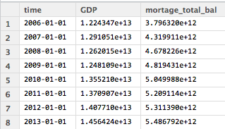

## 今日課程的目標

### 學會**extraction**, **cleaning**, **transformation**
  - 用R整理`結構`化資料 **STEP1 房貸餘額1** , **STEP2 GDP**
  - 用R整理`非結構化`資料 **STEP3新聞分析**
  
### 學會 **load**
  - 整併全部的資料 STEP4

### 邁向 **其他有意思的主題**


--- .dark .segue

## 學習，實作，觀察 STEP1

--- 

##  ETL `第一步`

</img>

---

## 開始收集資料(房貸餘額)

請連線到 
`https://survey.banking.gov.tw/statis/stmain.jsp?sys=100&funid=r100`


<iframe src = 'https://survey.banking.gov.tw/statis/stmain.jsp?sys=100&funid=r100' height='400px'></iframe>


---

## 開始收集資料

### 房貸餘額,直接下載現成的csv檔案

- 直接到[https://raw.githubusercontent.com/ntuaha/TWFS/master/db/cl_info_other.csv](https://raw.githubusercontent.com/ntuaha/TWFS/master/db/cl_info_other.csv)下載檔案
- 應該會看見`cl_info_other.csv`
- 讀入它!


或是

```r
library(DSC2014Tutorial)
ETL_file("cl_info_other.csv")
```

--- 

## 讀入資料 - read.table

至少要記得的 `read.table`
```
Cl_info = read.table(file='檔案路徑',sep=",",stringsAsFactors=F,header=T)
```
- 輸出形態為`Data Frame`
- file 就是指讀入的檔案路徑
- sep 指的是欄位分割用的符號,通常csv檔案格式是透過`,`做分割
- stringsAsFactors 預設是`True`, 會讓讀入的字串都用Factor形態儲存，那麼資料就會轉為整數儲存與額外的對照表
- header 預設是`False`，表示第一行是不是表格標頭，作為輸出的dataframe欄位名的colnames

--- 

## 看看讀入結果

```
View(Cl_info)
str(Cl_info)
```
</img>


--- .quote

<q>直接讀入是否覺得怪怪的?</q>


--- 

## 再看一次

</img>


- `etl_dt` `data_dt` 是`文字`但應該是`時間`
- `bank_code` 也是`文字`但應該是`factor`


---

## Transformation - 資料處理


### 將資料讀入


```
library(DSC2014Tutorial)
Cl_info = read.table(file=ETL_file('cl_info_other.csv'),header=T,sep=",",stringsAsFactors=F)
Cl_info_part = mutate(Cl_info,data_dt = as.POSIXct(data_dt),
                 bank_code = as.factor(bank_code),etl_dt = as.POSIXct(etl_dt))
View(Cl_info_part)
str(Cl_info_part)
```

<br/>
> - 到這裡已經完成第一次的資料`Extraction`與`Transformation`了！

--- .quote

<q>看見資料了!但是剛剛處理過程中的`mutate`是什麼?</q>


--- .quote

<q>看見資料了!但是剛剛處理過程中的`mutate`是什麼?</q>

<q> 在`R`中用來做__資料清理__與__資料處理__好用的套件`dplyr`其中之一的函式<q>


--- .quote

<q> 接下來我們將介紹三個基本函式 </q>

</img>

--- &twocol_dynamic w1:68% w2:28%


## 練習-挑選`欄位`(1/2)

### dplyr `select` 函式，用來__挑選__`欄位`

*** =left

```
Cl_demo1 = select(資料表,欄位1,欄位2,欄位3)
```

- `第一個參數`為輸入的data frame
- `後續參數`為選取的欄位名稱

<br/>
###  給熟悉`SQL`的使用者

```
select data_dt,bank_nm,mortgage_bal from Cl_info;
```

*** =right

</img>

--- &twocol_dynamic w1:68% w2:28%

## 練習-挑選`欄位`(2/2)

### dplyr `select` 函式，用來__挑選__`欄位`

*** =left

```
Cl_demo1 = select(Cl_info,data_dt,bank_nm,mortgage_bal)
```

- `第一個參數`為輸入的data frame
- `後續參數`為選取的欄位名稱

<br/>
###  給熟悉`SQL`的使用者

```
select data_dt,bank_nm,mortgage_bal from Cl_info;
```

*** =right

</img>


--- &twocol_dynamic w1:68% w2:28%

## 練習-挑選`資料`

### dplyr `filter` 函式，用來__保留__要留下的`資料列`

*** =left

```
Cl_demo2 = filter(Cl_info,mortgage_bal>1000000)
```

- `第一個參數`為輸入的data frame
- `第二個參數`為邏輯運算式，可用data frame裡的欄位，當結果為`True`時，該筆資料列保留

<br/>
### 給熟悉`SQL`的使用者
```
select * from Cl_info where mortgage>1000000;
```

*** =right

</img>


--- &twocol_dynamic w1:68% w2:28%


## 練習-增加`特徵`欄位(1/2)

### dplyr `mutate` 用來增加**非彙總**計算`欄位`

*** =left

```
Cl_demo3 = mutate(資料表,新欄位名 = 運算式)
```
- `第一個參數`為輸入的 data frame
- `第二參數`為計算式，也可以用來當做**轉換資料形態**，**變更欄位為名稱**使用

> - 例如: bank_code = as.numeric(bank_code)

<br/>
### 給熟悉`SQL`的使用者

```
select mortgage_bal/1000000 as mortage from Cl_info;
```


*** =right

</img>

--- &twocol_dynamic w1:68% w2:28%


## 練習-增加`特徵`欄位(2/2)

### dplyr `mutate` 用來增加**非彙總**計算`欄位`

*** =left

```
Cl_demo3 = mutate(Cl_info,mortage = mortgage_bal/1000000)
```

- `第一個參數`為輸入的 data frame
- `第二參數`為計算式，也可以用來當做**轉換資料形態**，**變更欄位為名稱**使用

<br/>
### 給熟悉`SQL`的使用者

```
select mmortgage_bal/1000000 as mortage from Cl_info;
```


*** =right

</img>


--- &twocol_dynamic w1:68% w2:28%

## 練習-`排序`資料(1/2)

### dplyr `arrange` 用來重新排序

*** =left


```
Cl_demo4 = arrange(資料表,欄位1,desc(欄位2)))
```

- `第一個參數`為輸入的 data frame
- `後續參數`為排序用欄位，預設遞增，可以透過`desc()`變成遞減排序

<br/>
### 給熟悉`SQL`的使用者

```
select * from Cl_info order by mortage,data_dt desc ;
```

*** =right

</img>


--- &twocol_dynamic w1:68% w2:28%

## 練習-`排序`資料(2/2)

### dplyr `arrange` 用來重新排序

*** =left


```
Cl_demo4 = arrange(Cl_info,mortgage_bal,desc(data_dt))
```
- 輸出data frame
- `第一個參數`為輸入的 data frame
- `後續參數`為排序用欄位，預設遞增，可以透過`desc()`變成遞減排序

<br/>
### 給熟悉`SQL`的使用者

```
select * from Cl_info order by mortage,data_dt desc ;
```

*** =right

</img>


---

## 練習時間

1. 請幫忙從Cl_info_part找出`data_dt`,`bank_nm`,`mortgage_bal`
2. 請幫忙從Cl_info_part挑選出`mortgage＿bal`大於1千萬的銀行資料
3. 請幫忙排序Cl_info_part出`mortgage＿bal`由小到大，但資料時間`data_dt`從大到小
4. 請執行下面程式碼，我們後續會利用`Cl_info_part2`


```
Cl_info_part2 = mutate(Cl_info_part,time= as.POSIXct(data_dt))
```


--- .dark .segue

## 學習，實作，觀察 STEP2

--- .quote

<q>讓我們來練習抓下一個資料`GDP`</q>

---

##  ETL `第二步`

</img>


--- 

## 開始收集資料(GDP)

請連線到 `http://ebas1.ebas.gov.tw/pxweb/Dialog/NI.asp`

<iframe src = 'http://ebas1.ebas.gov.tw/pxweb/Dialog/NI.asp' height='400px'></iframe>

---

## 開始收集資料(GDP)

1. GDP從直接下載`國民生產毛額之處分`
2. 季(1980之後）
3. 選**全部的日期**
4. 選**全部的計價方式**
5. 項目選**GDP**
6. 總類選**原始值**
7. 按繼續後，選**從螢幕顯示Excel檔**
8. 開啟後，**另存新檔成csv檔**
9. 開回`RStudio` 開始處理資料

或是`ETL_file("GDP.txt")`

--- &vcenter

<q>練習讀入與創建一個`GDP`的 data frame</q>

--- .quote


<q>答案</q>

```r
GDP = read.table(file=ETL_file("GDP.txt"),sep=",",stringsAsFactors=F,header=F)
```

--- .quote

<q>輸入`View(GDP)`觀察`GDP`會發現怎麼前後有很多列的資料是不要的</q>
</img>

### 好亂，我想`整理`好這個data frome

--- &twocol_dynamic w1:38% w2:58%

## 資料清理

*** =left
### 要處理的標的物有

 1. 去除前後`不相干`的資料列
 2. 轉換欄位的格式
   - 將單位轉換，從`百萬元變成元`
   - 將不應該出現的`,`去除
 3. 抽離`年份`與`季`

*** =right

</img>


--- 

## 去除前後不相干的資料列


```
GDP_part = GDP[5:137,]
```

### 別忘了改上欄位名稱

```
colnames(GDP_part) = c("time","GDP","GDP_yoy","GDP_2006","GDP_2006_yoy",
                        "GDP_minus","GDP_minus_yoy")
```

</img>

---

## 去除rownames

```
rownames(GDP_part) = NULL
View(GDP_part)
```

另外一個簡單的例子

```
iris
iris_part <- iris[4:6,]
rownames(iris_part) <- c('a','c','d')
View(iris_part)
```


--- 

## 轉移文字格式


```
# 去除中間不合理的,在數字欄位上與補上百萬
GDP_part2= mutate(GDP_part,GDP = as.numeric(gsub(",", "",GDP))*1000000)

```

1. 我們利用了 `gsub`, 替換字元，將原先有問題的`,`去除
2. 而後利用了`as.numeric` 將原來的`文字`形態改成`數字`

</img>

---

## 抽離年份與季


```
GDP_part3 = mutate(GDP_part2,year=as.numeric(substr(time,0,4)),
                            season=as.numeric(substr(time,6,6)))
GDP_part4 = select(GDP_part3,year,season,GDP)
```

1. 我們利用了 `substr`, 取出特定位置的資料
2. 再次利用`as.numeric`, 將文字轉成數字

</img>


---

## 練習時間

1. 去除頭尾不合理的資料列
2. 去除GDP的 `,` , 然後將它轉成數字
3. 將`year`,`season`抽離出來並轉成數字，同時最後資料只保留`GDP`,`year`,`season`


--- .quote 

<q>擁有了`GDP`和`房貸餘額`，那接下來呢?</a>
</img>

--- &vcenter

<q>`非結構化`的新聞與股市資料!</q>


--- .dark .segue

## 學習，實作，觀察 STEP3

---

##  ETL `第三步`

</img>


---

## 匯入套件

```{r message=FALSE}
require(RSelenium)
require(stringr)
require(xts)
require(reshape2)

```

---

## 打開 phantomjs

```r

２２
```

---

## 開始抓 yahoo 新聞
```r
title <- list()

for(i in 1:10){
  url <- sprintf('https://tw.news.yahoo.com/real-estate/archive/%d.html', i)
  remDr$navigate(url)
  doc <- remDr$findElements("xpath", "//ul/li/div/div/h4/a")
  tmp <- sapply(doc, function(doc){
    doc$getElementText()})
  title <- append(title, tmp)
} 
```

---

## 讀寫表格資料

```r
setwd('~/R_ETL/jiawei/)
doc <- do.call(rbind, title)
writeLines(doc, "news_yahoo.txt")
news_yahoo <- readLines('news_yahoo.txt')
```

---

## 匯入這次用的資料

### [鉅亨網　房地產新聞](http://house.cnyes.com/News/tw_housenews/List.htm)
```{r message=FALSE}
setwd('~/R_ETL')
hourse_news <- readLines('jiawei/news.txt') 
head(hourse_news)
```

---

## 抓出 時間 與 文章

 - [常規表示法| R 學習筆記](http://www.google.com/url?sa=t&rct=j&q=&esrc=s&source=web&cd=1&ved=0CB4QFjAA&url=http%3A%2F%2Fstatlab.nchc.org.tw%2Frnotes%2F%3Fpage_id%3D171&ei=xWzSU9fGEIiB8gW91IKYCQ&usg=AFQjCNE71BgJhsypu4NhHxgpk3pDTOGZ9g&sig2=ie3biJghIW601YTFHbbZJg&bvm=bv.71667212,d.dGc)
 - [正则表达式30分钟入门教程](http://deerchao.net/tutorials/regex/regex.htm)
```{r}
dates <- str_extract(hourse_news, "\\d{4}-\\d{2}-\\d{2}")
titles <- str_replace(hourse_news, "\\d{4}-\\d{2}-\\d{2}", "")

hourse_news <- cbind(dates, titles)
```
```{r echo=FALSE}
head(hourse_news,3)
```

---

## 有了新聞後，怎麼知道有哪些單字？

> - 自己手動打？ex. 房價、北市,、捷運 ...

> - 用程式從文章抓

---

## 有了新聞後，怎麼知道有哪些單字？

- 自己手動打？ex. 房價、北市,、捷運 ...

- 用程式從文章抓

```{r}
substr('富邦人壽信義區再插旗 A25案172億元奪標', 1, 4)
substr('富邦人壽信義區再插旗 A25案172億元奪標', 5, 7)
```


---

## N-Grame

```{r}
ngram <- function(sentence, n){
  chunk <- c()
  for(i in 1 : (nchar(sentence)-n+1)){
    chunk <- append(chunk, substr(sentence, i, i+n-1))
  }
  return(chunk)
}
```
```{r}
ngram('富邦人壽信義區再插旗', 2)
```

---

## 把 N-Gram 詞彙匯聚在一起

```{r}
piece <- c()

for(i in 1:length(hourse_news)){
  piece <- append(piece, ngram(titles[i], 1))
  piece <- append(piece, ngram(titles[i], 2))
  piece <- append(piece, ngram(titles[i], 3))
  piece <- append(piece, ngram(titles[i], 4))
  piece <- append(piece, ngram(titles[i], 5))
  piece <- append(piece, ngram(titles[i], 6))
}

```

---

## 清除符號 (只是列出來，並沒有要做)

```r
piece_clean <- str_replace_all(piece, punctuation, "")
piece_clean <- str_replace_all(piece_clean, "[[:punct:]]", "")
piece_clean <- str_replace_all(piece_clean, "[[:blank:]]", "")
piece_clean <- str_replace_all(piece_clean, " ", "")

```

---

## 如果想清除中文特殊符號 ...

### 這是 utf-8 編碼

```{r}
punctuation <- "\u3002 \uff1b \uff0c \uff1a \u201c \u201d \uff08 \uff09 \u3001 \uff1f \u300a \u300b"

punctuation
```

---

## 算 單字 出現次數

```{r}
piece_clean <- piece
word_freq <- table(piece_clean)
```
```{r echo=FALSE}
word_freq[c('信義區', '北市', '房價', '房市', '上漲')]
```

--- 

## 分出 單字長度 區塊

```{r}
words_length <- 
list(
  "1" = names(word_freq[nchar(names(word_freq))==1]),
  "2" = names(word_freq[nchar(names(word_freq))==2]),
  "3" = names(word_freq[nchar(names(word_freq))==3]),
  "4" = names(word_freq[nchar(names(word_freq))==4]),
  "5" = names(word_freq[nchar(names(word_freq))==5]),
  "6" = names(word_freq[nchar(names(word_freq))==6])
)

tail(words_length[["2"]])
```


---

## 算出機率

```{r}
N <- sum(word_freq[words_length[['1']]])
words_weight <- word_freq / N
```
```{r echo=FALSE}
tail(words_weight, 5)
```


---

## 算出單字左右亂度

```{r}
disorder <- function(word){
  
  BASE <- words_length[[as.character(nchar(word)+1)]]
  
  PATTEN1 <- paste("^", word, sep = '')
  matchs1 <- grep(PATTEN1, BASE, value = TRUE)
  pre <- mean(-log2(words_weight[matchs1]))
  
  PATTEN2 <- paste(word, "$", sep = '')
  matchs2 <- grep(PATTEN2, BASE, value = TRUE)
  post <- mean(-log2(words_weight[matchs2]))
  
  index <- is.na(c(pre, post))
  condition <- any(index)
  return(ifelse(condition, c(pre, post)[index], min(pre, post)))
  
}
```

---

## 挑出文章裡面的 單字

### 先挑出單字長度 2~5 的 候選詞彙
```{r}
word_2_5 <- unlist(words_length[2:5])
```
```{r echo=FALSE}
word_2_5[sample(1000,15)]
```

--- &vcenter

## 單字 出現次數分佈

```{r echo=FALSE, message=FALSE}
plot(word_freq[word_2_5], xlab = 'index', ylab = 'count')
```

---

## 算出 候選詞彙 左右兩側的混亂程度

### 出現次數>2 的 候選詞彙 
```{r}
words <- names(which(word_freq[word_2_5] > 2))
```

### 把 候選詞彙 丟下去計算
```{r}
disorder_val <- sapply(words, disorder, USE.NAMES = FALSE)
names(disorder_val) <- words
```

```{r echo=FALSE}
tail(names(sort(disorder_val)), 15)
```

--- &vcenter
## 單字的 混亂程度分佈

```{r echo=FALSE}
plot(disorder_val, xlab='index', ylab = 'value')
```

---
## 混亂程度

### 兩側混亂程度高的字
```{r echo=FALSE}
tail(names(sort(disorder_val)), 15)
```

### 兩側混亂程度低的字
```{r echo=FALSE}
head(names(sort(disorder_val)), 15)
```

---

## 挑出 混亂程度>12 的單字

### 根據前面的分佈圖來決定用 > 12 ...

```{r}
test_words <- names(which(disorder_val > 12))
```
```{r echo=FALSE}
tail(test_words, 20)
```

---

## 切單字

```{r}
segmentWord <- function(word){
  n <- nchar(word)-1
  seg <- lapply(1: n, function(i){
    w1 <- substr(word, 1, i)
    w2 <- substr(word,i+1, n+1)
    c(w1,w2)
  })
  return(seg)
}
```

---
## 用法

```{r}
segmentWord('富邦人壽')
```


---

## 算單字的凝聚程度

```{r}
cohesion <- function(word){
  seg <- segmentWord(word)
  val <- sapply(seg, function(x){    
    f_word <- word_freq[word]
    f_x1 <- word_freq[x[1]]
    f_x2 <- word_freq[x[2]]
    mi <- log2(N) + log2(f_word) - log2(f_x1) - log2(f_x2)
    return(mi)
  }) 
  return (min(val))
}

```

---
## 抓凝聚程度較高的字

```{r}
cohesion_val <- sapply(test_words, cohesion, USE.NAMES = FALSE)
names(cohesion_val) <- test_words
test_words_2 <- names(which(cohesion_val > 2))
```

---
## 算出單字 每個時間點的 出現次數

```{r}
tmp <- lapply(test_words_2, function(word) str_count(titles, word))
words_tbl <- do.call(cbind, tmp)
colnames(words_tbl) <- test_words_2
rownames(words_tbl) <- dates
```
```{r echo=FALSE}
words_tbl[1:6, sample(300, 8)]
```


---
## 轉換成 xts格式

```{r}
words_tbl_xts <- xts(words_tbl, as.POSIXct(dates))
```

### 可以選取時間

```{r}
words_tbl_xts["2014-01-18/2014-01-20", 100:110]
```

--- 

## 對時間區間做運算

### 1~2月 每個禮拜的出現次數做加總
```{r}
ep.weeks <- endpoints(words_tbl_xts, "weeks", k=1)
count.weeks <- period.apply(words_tbl_xts, ep.weeks, FUN=colSums)
count.weeks["2014-01/2014-02", 100:110]
```

---

## 下載營建股 股票指數

### [營建股清單](http://www.wantgoo.com/stock/classcont.aspx?id=32)

或是用套件中的資料

```r
library(DSC2014Tutorial)
f = file(ETL_file("stock.csv"))# file('~/stock.csv', encoding='utf-8')
stock <- read.csv(f, stringsAsFactors=FALSE)

stock_no <- stock[,1]
stock_name <- stock[,2]
stock_code <- paste(stock_no, '.TW', sep='')
```

--- 

## 開始下載

```r
getSymbols(stock_code, env=mystocks, from="2014-01-01", to="2014-07-02")
mystocks <- do.call(cbind,eapply(mystocks, Cl))
names(mystocks) <- stock_name
saveRDS(mystocks, "mystocks.rds")
```


---
## 算出每支股票的 平均漲跌

```{r}
mystocks <- readRDS(ETL_file("mystocks.rds"))#readRDS('jiawei/mystocks.rds')
mystocks.return <- diff(mystocks, 1) / mystocks
```
```{r echo=FALSE}
head(mystocks.return[1:8,1:5])
```

---
## 全部平均來看 ...
```{r}
mystocks.return_all <- apply(mystocks.return[-1,], 1, mean)
```
```{r echo=FALSE}
#head(mystocks.return_all[1:8])
plot(mystocks.return_all, type = 'l', xlab = 'index', ylab = 'value')
```


---

## 找出股票漲跌的五個狀態

### 漲多,、漲少,、不變,、跌少,、跌多
### 利用 kmeans 來判斷

```{r}
cl <- kmeans(mystocks.return_all, 5)
return.status <- data.frame(cl$cluster)
```
```{r echo=FALSE}
head(return.status)
```


--- &twocol

## 如果想知道其中的 `相關性` ...

*** =left
### `關鍵字出現的次數`
```{r echo=FALSE}
words_tbl[1:6,100:105]
```

*** =right
### `股市漲跌的狀態`
```{r echo=FALSE}
head(return.status)
```


--- &twocol

## 如果可以把`5個漲跌狀態`變成欄位 ...

*** =left
### 原本的表格
```{r echo=FALSE, message=FALSE}
head(return.status)
```

*** =right
### 希望的表格

```{r echo=FALSE, message=FALSE}
head(dcast(return.status, return_date  ~ cl.cluster, fill = 0))
```


---

##  整理出需要的欄位狀態

```{r}
return_date <- rownames(return.status)
return.status <- cbind(return_date, "status"=return.status)
return.status <- cbind(return.status, "val"=rep(1,127))
```
```{r echo=FALSE}
head(return.status)
```


---

## 欄位旋轉

### 將`漲跌狀態`旋轉到欄位
```{r message=FALSE}
return.status <- dcast(return.status, return_date  ~ cl.cluster, fill = 0)
```

### 轉換成`xts`格式
```{r}
return.status <- data.frame(return.status,stringsAsFactors=FALSE)
return.status.xts <- xts(return.status[,-1], as.POSIXct(return_date))

```
```{r echo=FALSE}
head(return.status.xts)
```


---

## 把`關鍵字`和`股票漲跌`依據`時間`做合併

```{r}
final_tbl <- merge.xts(words_tbl_xts, return.status.xts, fill=0)
names(final_tbl) <- c(test_words_2, names(return.status[,-1]))
```
```{r echo=FALSE, message=FALSE}
tmp <- dim(final_tbl)[2]
final_tbl[1:6, (tmp-8):tmp]
```

---

## 算 彼此之間的相關度

### 計算 `共變異矩陣`
```{r}
tbl_cov <- cov(final_tbl)
```

### 計算 `曼哈頓距離`
```{r}
d <- dist(t(final_tbl),  method = "manhattan")
d2 <- as.matrix(d) 
```

--- &twocol

## 和`漲跌狀態`有關的`關鍵字`

*** =left

### 和`X1狀態`較接近的關鍵字
```{r}
score <- sort(d2[,'X1'])
words <- names(score)
head(data.frame(words), 10)
```

*** =right
### 和`X4狀態`較接近的關鍵字
```{r}
score <- sort(d2[,'X4'])
words <- names(score)
head(data.frame(words), 10)
```

---
## 整理一下 ...
```{r}
kw <- list()
for(i in 1:5){
  col <- sprintf("X%s", i)
  kw <- cbind(kw, names(head(sort(d2[,col]), 10)))
}
```
```{r echo=FALSE}
kw
```

---
## 漲跌狀態對應的關鍵字, 出現在哪些新聞標題？ (1/2)

```{r}
index <- str_extract(titles, "房貸|所得")
titles[!is.na(index)]
```

---
## 漲跌狀態對應的關鍵字, 出現在哪些新聞標題？ (2/2)
```{r}
index <- str_extract(titles, "店租|標脫")
titles[!is.na(index)]

```

--- 
## 一些後續應用 

### 既然已經整理出表格了, 就可以...

### 拿去跑各種奇奇怪怪的迴歸分析 / 機器學習

### 做降維(mds, pca, svd ...)，然後視覺化

### 以上請期待下一輪 R tutorail


---
##  降維視覺化的小範例
```{r}
fit <- cmdscale(d2, eig = TRUE, k=2)
x <- fit$points[,1]
y <- fit$points[,2]
```

```r
plot(x, y, xlab="Coordinate 1", ylab="Coordinate 2", type = "n")
text(x, y, labels = row.names(t(final_tbl)), cex=.7)
```


--- .dark .segue

## 學習，實作，觀察 STEP4

---

## ETL `最後一步`

</img>


---

## 資料整併

### 要處理的標的物有

1. 將**房貸餘額**匯總到`每個月`的資料
2. 將**GDP**匯總到`每年`的資料
3. 透過`年份`將**房貸餘額**與**GDP**的表`結合`起來


---

## 資料整併流程

</img>


---

## 資料彙總

將介紹 `group_by`, `summarize`
</img>


--- &twocol_dynamic w1:78% w2:18%

## 練習-資料`彙總`(1/2)

*** =left

### `group_by` 用來將資料`包裝成一組`，做後續的彙總
### `summarise`則用來做後續的各類`彙總操作`

```
Cl_info_part3 = group_by(Cl_info_part2,time)  #先匯總
Cl_info_part4 = summarise(Cl_info_part3,
        mortage_total_bal = sum(mortgage_bal, na.rm = TRUE))

```
- `第一個參數`為輸入的 data frame
- `第二個欄位`之後都是用來group by/summarise 的欄位

### 給熟悉`SQL`的使用者

```
select sum(mortgage_bal) as mortage_total_bal 
                        from Cl_info group by time ;
```

*** =right
</img>

--- &vcenter

<q>group by 可加先下也可不下，不下的情況是直對接`全部`資料做集匯總運算 </q>


---

## 練習-資料`彙總`(2/2)


1.  將房貸餘額每個月的值算出來
2.  將GDP每年的值算出來


```
GDP_part5 = filter(summarise(group_by(GDP_part4,year),GDP=sum(GDP)),is.na(year)==F)        
```

</img>


---

## 彙總函數 summarise

可以使用的函數如下所列

 - mean  平均值
 - sum   加總 
 - n     計算個數  例如: A B B C   輸出`4` 
 - n_distinct 計算不同物件的個數 例: A B B C 輸出`3`
 - max, min 最大或最小值
 - median 中位數

---

## mean

### 請計算每月全體銀行餘額平均值(eg1)

</img>


---

## n

### 請計算每個月有多少家銀行有房貸餘額(eg2)

</img>


---

## n_distinct

### 請計算每年有多少家銀行有房貸餘額(eg3)


</img>

---

## max

### 請計算每月單一銀行擁有的最多房貸餘額(eg4)


</img>


---

## first, last

### 請計算每月房貸餘額排名第ㄧ的銀行(eg5)

</img>


---

## 複雜一點的函數

 - first 該群體第一個，可配合`order_by` 使用;  first(x,order_by=y)
 - last  該群體最後一個，可配合`order_by` 使用;  last(x,order_by=y)
 - nth   該群體的第n個，可配合`order_by` 使用;  nth(x,10))

---

## nth

### 請計算每月房貸餘額排名第2的銀行 (eg6)

</img>


---

## 練習題目- 解答(1/2)

```


eg1 =  summarise(group_by(Cl_info_part2,time) , 
         mortage_mean_bal = mean(mortgage_bal, na.rm = TRUE))

eg2_1 = filter(Cl_info_part2,mortgage_bal >0)
eg2_2 = summarise(group_by(eg2_1,time),count = n())

eg3_1 = filter(Cl_info_part2,mortgage_bal >0)
eg3_2 = mutate(eg3_1,year = format(time,"%Y"))
eg3_3 = summarise(group_by(eg3_2,year),count = n_distinct(bank_nm))
```

---

## 練習題目- 解答(2/2)

```
eg4 = summarise(group_by(Cl_info_part2,time),
       val = max(mortgage_bal))

eg5 = summarise(group_by(Cl_info_part2,time),
         val = last(bank_nm,order_by=mortgage_bal))


eg6_1 = arrange(Cl_info_part2,time,desc(mortgage_bal))
eg6_2 = summarise(group_by(eg6_1,time),
          val = nth(bank_nm,2))
```


--- .segue bg:red

## 接下來比較難，真的!!!!

--- 

## 結合表格

1. cbind 用來做 `1-1` **水平**結合
2. rbind 用來做 **垂直**結合
3. left_join 用來做`多對多` **水平**結合
4. inner_join 用來做`多對多` **水平**結合

> 看得懂在幹嘛嗎?


---

## 圖解`結合表格`


</img>


--- &twocol_dynamic w1:68% w2:28%

## join講解前資料準備

*** =left
### 接下來先從各類join開始說明
先`建立資料集`

```
x=data.frame(c1 = c(1,1,2,3,4,5,5),
             c2 = c('A','B','C','D','E','F','G'))
y=data.frame(c1 = c(1,2,2,3,4,6,6),
             c2 = c('A','B','C','D','E','F','G'))
```

*** =right


--- &twocol_dynamic w1:68% w2:28%

## join講解前資料準備

*** =left
### 接下來先從各類join開始說明
先`建立資料集`

```{r}
x=data.frame(c1 = c(1,1,2,3,4,5,5),
             c2 = c('A','B','C','D','E','F','G'))
y=data.frame(c1 = c(1,2,2,3,4,6,6),
             c2 = c('A','B','C','D','E','F','G'))
```

打入 `View(x)`與`View(y)`應該會看見

*** =right

</img>

---

## dplyr 介紹 - left_join 

### 參數`by` 指出以何欄位作為對照鍵值
透過先前創建的`x`與`y`，以及交集的鍵值`c1`
```
ljxy = left_join(x,y,by="c1") #以X為主
ljyx = left_join(y,x,by="c1") #以Y為主
```
</img>


--- &twocol

## dplyr 介紹 - inner_join

*** =left
### `inner_join` 取出共有的鍵值
```{r}
inner_join(x,y,by="c1")
```

*** =right

</img>


---

## 實際問題 - 練習題

### 請問，這兩張表該怎麼結合比較好?
</img>

---  &radio2

### 請問，這兩張表該怎麼結合比較好?用誰當第一參數?


1. left_join Cl_Info_part4
2. semi_join Cl_Info_part4
3. _left_join GDP_part5_
4. _inner_join GDP_part5_
5. 其他

*** =image

</img>

*** .explanation

因為GDP_part5_所俱有的`時間點`較少，用這個當作主鍵是比較好的.

--- 

## 練習

1. 將GDP與房貸餘額，透過1月的資訊整理起來


```
GDP_part6 = select(mutate(GDP_part5 ,                    
                   time = as.POSIXct(paste(year,'1','1',sep='-'))),time,GDP)
t1 = left_join(GDP_part6,Cl_info_part4,by="time")
t2 = filter(t1,is.na(mortage_total_bal)==FALSE)
```
看一下資料 `View(t2)`

</img>


--- .segue bg:indigo

## 最後一里路


--- &twocol_dynamic w1:18% w2:78%

## 接下來我們應該做(1/3) - 畫圖

```
see1 = filter(mutate(t2,ratio =mortage_total_bal/GDP),is.na(ratio)==FALSE)
```

*** =left

1. `畫圖`

*** =right

```{r plotChunk, message=FALSE, fig.height=5, fig.width=8}
library(ggplot2)
ggplot(see1, aes(time, ratio))+geom_smooth(method="loess") +
  scale_size_area() +geom_point(aes(size = 20), alpha = 1/2) 
```


--- &twocol_dynamic w1:18% w2:78%

## 接下來我們應該做(2/3) - 解釋

利用`解釋`將圖想要表達的意思更清楚地傳達給觀眾

*** =left

1. 畫圖
2. `解釋`

*** =right
1. 09達到高峰，但之後房貸與GDP的比值平穩維持在37.5%
2. GDP成長比率與房貸餘額幾乎成正比
3. 從新聞顯示
  - 09年遺產稅調降, 許多人回來`投資`?`炒房`?
  - 10年開始打房政策
  - 如果加上`房價所得比`，還可以說什麼呢?

--- &twocol_dynamic w1:18% w2:78%

## 接下來我們應該做(3/3) - 報告

將所有的解釋與圖表`包裝成一個故事`，展現出來

*** =left

1. 畫圖
2. 解釋
3. `報告`

*** =right

</img>


--- .segue bg:orange

## Review

--- &twocol_dynamic w1:18% w2:78%

## 我們做了什麼?

*** =left

> - 設定問題
> - 下載與讀入與整理
> - 整合資料
> - 畫圖
> - 解釋
> - 報告


*** =right

</img>

--- .segue bg:green

## 額外延伸主題

---

## 自動化

- 建立R Script

```
iris
iris_part <- iris[4:6,]
rownames(iris_part) <- c('a','c','d')
write.csv(iris_part,file="[想要的目錄]/GG.csv")
```


- 儲存到特定位置下  假定叫做Script.R
- 在terminal執行


```
R CMD BATCH [該檔案儲存位置]/Script.R
```

- 可透過`crontab`定期執行

---

## 從網路讀檔案

- 安裝套件

```
install.packages("RCurl")
library(RCurl)
```

- 讀檔案

```
DF = read.table(sep=",", header=TRUE,            
file= 
textConnection(getURL("https://raw.githubusercontent.com/ntuaha/TWFS/master/db/cl_info_other.csv")))
```


--- .segue bg:blue

## Speical

---

## Topics

1. 自動化排程
2. 與資料庫溝通
3. 其他的資料源
   - 結構化資料
   - 非結構化資料
4. 培養對資料的品味

---

## Reference

1. [http://cran.rstudio.com/web/packages/dplyr/vignettes/introduction.html](http://cran.rstudio.com/web/packages/dplyr/vignettes/introduction.html)
2. [http://cran.r-project.org/web/packages/dplyr/dplyr.pdf](http://cran.r-project.org/web/packages/dplyr/dplyr.pdf)
