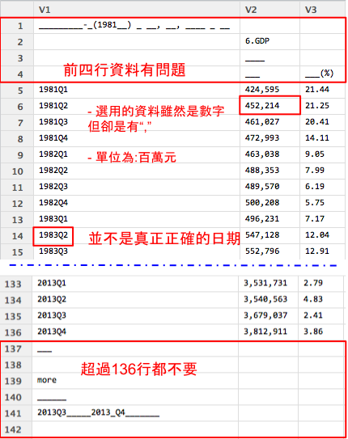
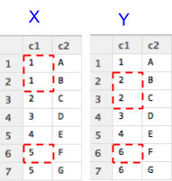
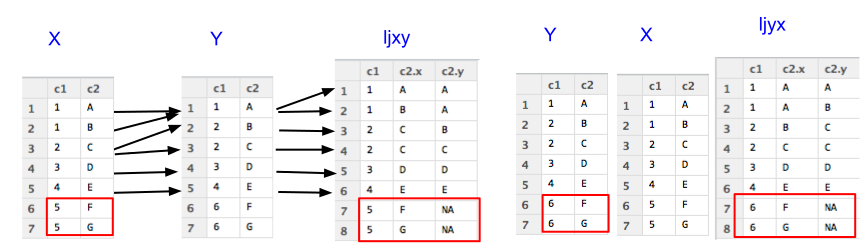
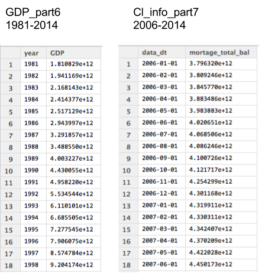
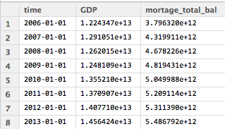
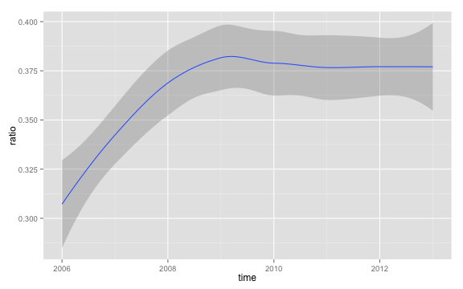

## 故事的起源

> 1. 房價節節高升
> 2. 大熊被抓了
> 3. 房價真的太高了嗎?

--- &twocol

## 資料在哪裡

*** =left
### 你想知道什麼資料?

> 1. GDP
> 2. 房貸餘額
> 3. 股價
> 4. 新聞

*** =right
### 可能的來源?
> 1. 政府公開資料
> 2. 新聞
> 3. 股市


--- &vcenter

<q>即便知道資料在哪，可是資料還是如同`一盤散沙`</q>

---  

## ETL

> 1. Extraction
> 2. Transformation
> 3. Loading

--- .dark .segue

## 學習，實作，觀察


--- 

## 讀入資料 - read.table

至少要記得的 `read.table`
```
DF = read.table(file='檔案路徑',sep=",",stringsAsFactors=F,header=T)
```
- 輸出形態為`Data Frame`
- file 就是指讀入的檔案路徑
- sep 指的是欄位分割用的符號,通常csv檔案格式是透過`,`做分割
- stringsAsFactors 預設是`True`, 會讓讀入的字串都用Factor形態儲存，那麼資料就會轉為整數儲存與額外的對照表
- header 預設是`False`，表示第一行是不是表格標頭，作為輸出的dataframe欄位名的colnames

--- .quote 

<q> 等等 先安裝幾個建議的套件</q>

> - `dplyr` 可用類似SQL語法操作data frome
> - `xts` 處理時間格式好用的套件
> - `gdata` 可以處理Excel 2007以上的文件


--- .quote 

<q> 等等 先安裝幾個建議的套件</q>

- `dplyr` 可用類似SQL語法操作data frome
- `xts` 處理時間格式好用的套件
- `gdata` 可以處理Excel 2007以上的文件

```
install.packages("dplyr")
install.packages("xts")
install.packages("gdata")
```


--- .quote

<q> 好! 開始動手做吧!</q>


--- .quote 

<q> 好! 開始動手做吧!</q>

<q> `資料勒？！`</q>

---

## 開始收集資料(房貸餘額)

<iframe src = 'https://survey.banking.gov.tw/statis/stmain.jsp?sys=100&funid=r100' height='600px'></iframe>

---
## 開始收集資料

### 房貸餘額,直接下載現成的csv檔案

- 直接到[https://raw.githubusercontent.com/ntuaha/TWFS/master/db/cl_info_other.csv](https://raw.githubusercontent.com/ntuaha/TWFS/master/db/cl_info_other.csv)下載檔案


### 將資料讀入


```r
library(dplyr)
Cl_info = read.table(file='./cl_info_other.csv',header=T,sep=",",stringsAsFactors=F)
Cl_info = mutate(Cl_info,data_dt = as.POSIXct(data_dt),
                 bank_code = as.factor(bank_code),etl_dt = as.POSIXct(etl_dt))
View(Cl_info)
```

<br/>
> - 到這裡已經完成第一次的資料`Extraction`與`Transformation`了！

--- .quote

<q>看見資料了!但是剛剛處理過程中的`mutate`是什麼?</q>


--- .quote

<q>看見資料了!但是剛剛處理過程中的`mutate`是什麼?</q>

<q> 在`R`中用來做__資料清理__與__資料處理__好用的套件`dplyr`其中之一的函式<q>

--- 

## dplyr 介紹 - select

### `select` 函式，用來__挑選__`欄位`
```
Cl_info_part = select(Cl_info,date_dt,bank_nm,mortgage_bal)
```
- 輸出data frame
- 第一個參數為輸入的data frame
- 後續參數為選取的欄位名稱

<br/>
###  給熟悉`SQL`的使用者

```
select data_dt,bank_nm,mortgage_bal from Cl_info;
```


---

## dplyr 介紹 - filter

### `filter` 函式，用來__保留__要留下的`資料列`

```
Cl_info_part2 = filter(Cl_info,mortgage_bal>1000000)
```

- 輸出data frame
- 第一個參數為輸入的data frame
- 第二個參數為邏輯運算式，可用data frame裡的欄位，當結果為`True`時，該筆資料列保留

<br/>
### 給熟悉`SQL`的使用者
```
select * from Cl_info where mortgage>1000000;
```


---


## dplyr 介紹 - mutate

### `mutate` 用來增加**非彙總**計算`欄位`

```
Cl_info_part3 = filter(Cl_info,mortage = mortgage/1000000)
```
- 輸出data frame
- 第一個參數為輸入的 data frame
- 第二參數為計算式，也可以用來當做**轉換資料形態**，**變更欄位為名稱**使用

<br/>
### 給熟悉`SQL`的使用者

```
select mmortgage/1000000 as mortage from Cl_info;
```

---

## dplyr 介紹 - arrange

### `arrange` 用來重新排序

```
Cl_info_part4 = arrange(Cl_info,mortage,desc(data_dt))
```
- 輸出data frame
- 第一個參數為輸入的 data frame
- 後續參數為排序用欄位，預設遞增，可以透過`desc()`變成遞減排序

<br/>
### 給熟悉`SQL`的使用者

```
select * from Cl_info order by mortage,data_dt desc ;
```

--- .quote

<q>下一個?</q>


--- .quote

<q>下一個?</q>

<q>別急，讓我們來練習抓下一個資料`GDP`</q>

--- 

## 開始收集資料(GDP)

<iframe src = 'http://ebas1.ebas.gov.tw/pxweb/Dialog/NI.asp' height='600px'></iframe>

---

## 開始收集資料(GDP)

1. GDP從直接下載`國民生產毛額之處分`
2. 季(1980之後）
3. 選**全部的日期**
4. 選**全部的計價方式**
5. 項目選**GDP**
6. 總類選**原始值**
7. 按繼續後，選**從螢幕顯示Excel檔**
8. 開啟後，**另存新檔成csv檔**
9. 開回`RStudio` 開始處理資料


--- &vcenter

<q>練習讀入與創建一個`GDP`的 data frame</q>

--- .quote


<q>答案</q>

```
GDP = read.table(file='檔案位置',sep=",",stringsAsFactors=F,header=F)
```

--- .quote


<q>答案</q>

```
GDP = read.table(file='檔案位置',sep=",",stringsAsFactors=F,header=F)
```
<br>

<q>輸入`View(GDP)`觀察`GDP`會發現怎麼前後有很多列的資料是不要的</q>


--- .quote

<q></q>
</img>


--- .quote

<q></q>
</img>

### 好亂，我想`整理`好這個data frome

--- &twocol_dynamic w1:38% w2:58%

## 資料清理

*** =left
### 要處理的標的物有

 1. 去除前後`不相干`的資料列
 2. 轉換欄位的格式
   - 將單位轉換，從`百萬元變成元`
   - 將不應該出現的`,`去除
 3. 抽離`年份`與`季`

*** =right

</img>


--- 

## 一步一步來(1/3) 

### 去除前後不相干的資料列

```
GDP_part1 = cbind(GDP,y=1:154)
GDP_part2 = filter(GDP_part1,y>4&y<137)
```

### 別忘了改上欄位名稱

```
colnames(GDP_part2) = c("time","GDP","GDP_yoy","GDP_2006","GDP_2006_yoy",
                        "GDP_minus","GDP_minus_yoy","row_no")
```

1. 利用`cbind`，作columns合併
2. 利用`colnames`，改變欄位名稱


--- 

## 一步一步來(2/3)

### 轉移文字格式

```
#去除中間不合理的,在數字欄位上與補上百萬
GDP_part3= mutate(GDP_part2,GDP = as.numeric(gsub(",", "",GDP))*1000000)

```

1. 我們利用了 `gsub`, 替換字元，將原先有問題的`,`去除
2. 而後利用了`as.numeric` 將原來的`文字`形態改成`數字`


--- 

## 一步一步來(3/3)

### 抽離年份與季

```
GDP_part4 = mutate(GDP_part3,year=as.numeric(substr(time,0,4)),
                            season=as.numeric(substr(time,6,6)))
GDP_part5 = select(GDP_part4,year,season,GDP)
```

1. 我們利用了 `substr`, 取出特定位置的資料
2. 再次利用`as.numeric`, 將文字轉成數字


--- &vcenter

<q>擁有了`GDP`和`房貸餘額`，那接下來我們該怎麼處理變成後續可以使用的資料呢？</a>

---

## 資料整併

### 要處理的標的物有

1. 將**房貸餘額**匯總到`每個月`的資料
2. 將**GDP**匯總到`每年`的資料
3. 透過`年份`將**房貸餘額**與**GDP**的表`結合`起來


---

## dplyr 介紹 - group_by, summarise

### `group_by` 用來將資料`包裝成一組`，做後續的彙總
### `summarise`則用來做後續的各類`彙總操作`

```
Cl_info_part6 = group_by(Cl_info_part5,data_dt) #先匯總
Cl_info_part7 = summarise(Cl_info_part6,
        mortage_total_bal = sum(mortgage_bal, na.rm = TRUE))
GDP_part6 = summarise(group_by(GDP_part5,year),GDP=sum(GDP))        
```
- 輸出data frame
- 第一個參數為輸入的 data frame
- 第二個欄位之後都是用來group by/summarise 的欄位
- 後續參數用來處理匯總運算

### 給熟悉`SQL`的使用者

```
select sum(mortgage_bal) as mortage_total_bal from Cl_info group by time ;
```

--- &vcenter

<q>group by 可加先下也可不下，不下的情況是直對接`全部`資料做集匯總運算 </q>


---

## 彙總函數 summarise

可以使用的函數如下所列

 - mean  平均值
 - sum   加總 
 - n     計算個數  例如: A B B C   輸出`4` 
 - n_distinct 計算不同物件的個數 例: A B B C 輸出`3`
 - first 該群體第一個，可配合`order_by` 使用;  first(x,order_by(y))
 - last  該群體最後一個，可配合`order_by` 使用;  last(x,order_by(y))
 - nth   該群體的第n個，可配合`order_by` 使用;  nth(x,10,order_by(y))
 - max, min 最大或最小值
 - median 中位數
 - IQR   就是IQR  ＃待驗證

---

//TODO 練習題目


--- .segue bg:red

## 接下來比較難，真的!!!!

--- 

## 結合表格

1. cbind 用來做 `1-1` **水平**結合
2. rbind 用來做 **垂直**結合
3. left_join 用來做`多對多` **水平**結合
4. inner_join 用來做`多對多` **水平**結合
5. anti_join 用來做`多對多` **水平**結合
5. semi_join 用來做`多對多` **水平**結合

前兩個很簡單,後面四個是如同`SQL`的join處理

```
left_join(x,y,by="c1")
```
對應
```
select x.*,y.*(扣除c1) from x left join y on x.c1=y.c1;
````


--- &twocol_dynamic w1:68% w2:28%

## join講解前資料準備

*** =left
### 接下來先從各類join開始說明
先`建立資料集`

```
x=data.frame(c1 = c(1,1,2,3,4,5,5),
             c2 = c('A','B','C','D','E','F','G'))
y=data.frame(c1 = c(1,2,2,3,4,6,6),
             c2 = c('A','B','C','D','E','F','G'))
```

*** =right


--- &twocol_dynamic w1:68% w2:28%

## join講解前資料準備

*** =left
### 接下來先從各類join開始說明
先`建立資料集`

```
x=data.frame(c1 = c(1,1,2,3,4,5,5),
             c2 = c('A','B','C','D','E','F','G'))
y=data.frame(c1 = c(1,2,2,3,4,6,6),
             c2 = c('A','B','C','D','E','F','G'))
```

打入 `View(x)`與`View(y)`應該會看見

*** =right

</img>

---

## dplyr 介紹 - left_join 

### 參數`by` 指出以何欄位作為對照鍵值
透過先前創建的`x`與`y`，以及交集的鍵值`c1`
```
ljxy = left_join(x,y,by="c1") #以X為主
ljyx = left_join(y,x,by="c1") #以Y為主
```
</img>


--- &twocol

## dplyr 介紹 - inner_join, anti_join

*** =left
### `inner_join` 取出共有的鍵值

```r
inner_join(x,y,by="c1")
```

```
##   c1 c2.x c2.y
## 1  1    A    A
## 2  1    B    A
## 3  2    C    B
## 4  2    C    C
## 5  3    D    D
## 6  4    E    E
```

*** =right

### `anti_join` 取出非共有的鍵值

```r
anti_join(x,y,by="c1")
```

```
##   c1 c2
## 1  5  F
## 2  5  G
```

```r
anti_join(y,x,by="c1")
```

```
##   c1 c2
## 1  6  F
## 2  6  G
```

*** =pnotes
</img>

--- &twocol

## dplyr 介紹 - semi_join

與`left_join`的差別在，只要對應不到的鍵值就不出現
*** =left
### `semi_join` 取出共有的鍵值,只留`x` 的欄位

```r
semi_join(x,y,by="c1")
```

```
##   c1 c2
## 1  1  A
## 2  1  B
## 3  2  C
## 4  3  D
## 5  4  E
```

*** =right

### `semi_join` 取出共有的鍵值,只留`y`的欄位

```r
semi_join(y,x,by="c1")
```

```
##   c1 c2
## 1  1  A
## 2  2  B
## 3  2  C
## 4  3  D
## 5  4  E
```

*** =pnotes

</img>


---

## 實際問題 - 練習題

### 請問，這兩張表該怎麼結合比較好?
</img>

---  &radio2

### 請問，這兩張表該怎麼結合比較好?用誰當第一參數?


1. left_join Cl_Info_part7
2. semi_join Cl_Info_part7
3. _left_join GDP_part5_
4. _semi_join GDP_part5_
5. 其他

*** =image

</img>

*** .explanation

因為GDP_part5_所俱有的`時間點`較少，用這個當作主鍵是比較好的.

--- 

## 資料整理完成!

```
GDP_part7 = select(mutate(GDP_part6 , 
                   time = as.POSIXct(paste(year,'1','1',sep='-'))),time,GDP)
t1 = left_join(GDP_part7,Cl_info_part7,by="time")
t2 = filter(t1,is.na(mortage_total_bal)==FALSE)
```
看一下資料 `View(t2)`

</img>


--- .segue bg:indigo

## 最後一里路


--- &twocol_dynamic w1:18% w2:78%

## 接下來我們應該做(1/3) - 畫圖

```
see1 = filter(mutate(t2,ratio =mortage_total_bal/GDP),is.na(ratio)==FALSE)
```

*** =left

1. `畫圖`

*** =right


```r
library(ggplot2)
ggplot(see1, aes(time, ratio))+geom_smooth(method="loess") +
  scale_size_area() +geom_point(aes(size = 20), alpha = 1/2) 
```

 


--- &twocol_dynamic w1:18% w2:78%

## 接下來我們應該做(2/3) - 解釋

利用`解釋`將圖想要表達的意思更清楚地傳達給觀眾

*** =left

1. 畫圖
2. `解釋`

*** =right
1. 09達到高峰，但之後房貸與GDP的比值平穩維持在37.5%
2. GDP成長比率與房貸餘額幾乎成正比
3. 從新聞顯示
  - 09年遺產稅調降, 許多人回來`投資`?`炒房`?
  - 10年開始打房政策
  - 如果加上`房價所得比`，還可以說什麼呢?

--- &twocol_dynamic w1:18% w2:78%

## 接下來我們應該做(3/3) - 報告

將所有的解釋與圖表`包裝成一個故事`，展現出來

*** =left

1. 畫圖
2. 解釋
3. `報告`

*** =right

</img>


--- .segue bg:orange

## Review

---

## 我們做了什麼?

- 設定問題
- 下載與讀入與整理房貸資料
- 下載與讀入與整理GDP
- 整合資料
- 畫圖
- 解釋
- 報告


--- .segue bg:green

## Excerises

---

## 資料處理練習

- 下載M1b M2 資料
- 整合之前的資料
- 比較房貸餘額與M1b的年增率相關性
- 房價餘額與存款總額的比值變化

---

## 函式運用練習

- 找**2014.02**房貸放款`數量最少`的銀行
- 將GDP改用`億新台幣`呈現

--- .segue bg:blue

## Speical

---

## Topics

1. 自動化排程
2. 與資料庫溝通
3. 其他的資料源
   - 結構化資料
   - 非結構化資料
4. 培養對資料的品味

---

## Reference

1. [http://cran.rstudio.com/web/packages/dplyr/vignettes/introduction.html](http://cran.rstudio.com/web/packages/dplyr/vignettes/introduction.html)
2. [http://cran.r-project.org/web/packages/dplyr/dplyr.pdf](http://cran.r-project.org/web/packages/dplyr/dplyr.pdf)
