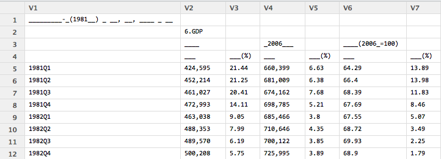
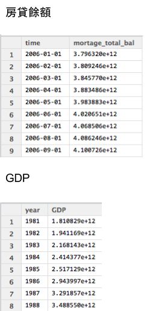

## 今日課程的目標

### 學會**extraction**, **cleaning**, **transformation**
  - 用R整理`結構`化資料 **STEP1 房貸餘額1** , **STEP2 GDP**
  - 用R整理`非結構化`資料 **STEP3新聞分析**
  
### 學會 **load**
  - 整併全部的資料 STEP4

### 邁向 **其他有意思的主題**


--- .dark .segue

## 學習，實作，觀察 STEP1

--- .quote 

<q> 等等 先安裝幾個建議的套件</q>

- `dplyr` 可用類似SQL語法操作data frome
- `xts` 處理時間格式好用的套件
- `gdata` 可以處理Excel 2007以上的文件

```
install.packages("dplyr")
install.packages("xts")
install.packages("gdata")
```


--- .quote

<q> 好! 開始動手做吧!</q>

---

## 開始收集資料(房貸餘額)

請連線到 
`https://survey.banking.gov.tw/statis/stmain.jsp?sys=100&funid=r100`


<iframe src = 'https://survey.banking.gov.tw/statis/stmain.jsp?sys=100&funid=r100' height='400px'></iframe>


---

## 開始收集資料

### 房貸餘額,直接下載現成的csv檔案

> - 直接到[https://raw.githubusercontent.com/ntuaha/TWFS/master/db/cl_info_other.csv](https://raw.githubusercontent.com/ntuaha/TWFS/master/db/cl_info_other.csv)下載檔案
> - 你應該會看見`cl_info_other.csv`
> - 讀入它!

--- 

## 讀入資料 - read.table

至少要記得的 `read.table`
```
DF = read.table(file='檔案路徑',sep=",",stringsAsFactors=F,header=T)
```
- 輸出形態為`Data Frame`
- file 就是指讀入的檔案路徑
- sep 指的是欄位分割用的符號,通常csv檔案格式是透過`,`做分割
- stringsAsFactors 預設是`True`, 會讓讀入的字串都用Factor形態儲存，那麼資料就會轉為整數儲存與額外的對照表
- header 預設是`False`，表示第一行是不是表格標頭，作為輸出的dataframe欄位名的colnames


--- 

## 看看讀入結果

```
View(Cl_info)
str(Cl_info)
```
</img>


--- .quote

<q>直接讀入是否覺得怪怪的?</q>


--- 

## 再看一次

</img>


---

## Transformation - 資料處理


### 將資料讀入


```r
library(dplyr)
Cl_info = read.table(file='./cl_info_other.csv',header=T,sep=",",stringsAsFactors=F)
Cl_info_part = mutate(Cl_info,data_dt = as.POSIXct(data_dt),
                 bank_code = as.factor(bank_code),etl_dt = as.POSIXct(etl_dt))
View(Cl_info)
```

<br/>
> - 到這裡已經完成第一次的資料`Extraction`與`Transformation`了！

--- .quote

<q>看見資料了!但是剛剛處理過程中的`mutate`是什麼?</q>


--- .quote

<q>看見資料了!但是剛剛處理過程中的`mutate`是什麼?</q>

<q> 在`R`中用來做__資料清理__與__資料處理__好用的套件`dplyr`其中之一的函式<q>

--- &twocol_dynamic w1:68% w2:28%


## 練習-挑選`欄位`(1/2)

### dplyr `select` 函式，用來__挑選__`欄位`

*** =left

```
Cl_demo1 = select(資料表,欄位1,欄位2,欄位3)
```

- `第一個參數`為輸入的data frame
- `後續參數`為選取的欄位名稱

<br/>
###  給熟悉`SQL`的使用者

```
select data_dt,bank_nm,mortgage_bal from Cl_info;
```

*** =right

</img>

--- &twocol_dynamic w1:68% w2:28%

## 練習-挑選`欄位`(2/2)

### dplyr `select` 函式，用來__挑選__`欄位`

*** =left

```
Cl_demo1 = select(Cl_info,data_dt,bank_nm,mortgage_bal)
```

- `第一個參數`為輸入的data frame
- `後續參數`為選取的欄位名稱

<br/>
###  給熟悉`SQL`的使用者

```
select data_dt,bank_nm,mortgage_bal from Cl_info;
```

*** =right

</img>


--- &twocol_dynamic w1:68% w2:28%

## 練習-挑選`資料`

### dplyr `filter` 函式，用來__保留__要留下的`資料列`

*** =left

```
Cl_demo2 = filter(Cl_info,mortgage_bal>1000000)
```

- `第一個參數`為輸入的data frame
- `第二個參數`為邏輯運算式，可用data frame裡的欄位，當結果為`True`時，該筆資料列保留

<br/>
### 給熟悉`SQL`的使用者
```
select * from Cl_info where mortgage>1000000;
```

*** =right

</img>


--- &twocol_dynamic w1:68% w2:28%


## 練習-增加`特徵`欄位(1/3)

### dplyr `mutate` 用來增加**非彙總**計算`欄位`

*** =left

```
Cl_demo3 = mutate(資料表,新欄位名 = 運算式)
```
- `第一個參數`為輸入的 data frame
- `第二參數`為計算式，也可以用來當做**轉換資料形態**，**變更欄位為名稱**使用

> - 例如: bank_code = as.numeric(bank_code)

<br/>
### 給熟悉`SQL`的使用者

```
select mortgage_bal/1000000 as mortage from Cl_info;
```


*** =right

</img>

--- &twocol_dynamic w1:68% w2:28%


## 練習-增加`特徵`欄位(2/3)

### dplyr `mutate` 用來增加**非彙總**計算`欄位`

*** =left

```
Cl_demo3 = mutate(Cl_info,mortage = mortgage_bal/1000000)
```

- `第一個參數`為輸入的 data frame
- `第二參數`為計算式，也可以用來當做**轉換資料形態**，**變更欄位為名稱**使用

<br/>
### 給熟悉`SQL`的使用者

```
select mmortgage_bal/1000000 as mortage from Cl_info;
```


*** =right

</img>

---

## 練習- 增加`特徵`欄位(3/3)

```
Cl_info_part2 = mutate(Cl_info_part,time= as.POSIXct(data_dt))
```


--- &twocol_dynamic w1:68% w2:28%

## 練習-`排序`資料(1/2)

### dplyr `arrange` 用來重新排序

*** =left


```
Cl_demo4 = arrange(資料表,欄位1,desc(欄位2)))
```

- `第一個參數`為輸入的 data frame
- `後續參數`為排序用欄位，預設遞增，可以透過`desc()`變成遞減排序

<br/>
### 給熟悉`SQL`的使用者

```
select * from Cl_info order by mortage,data_dt desc ;
```

*** =right

</img>


--- &twocol_dynamic w1:68% w2:28%

## 練習-`排序`資料(2/2)

### dplyr `arrange` 用來重新排序

*** =left


```
Cl_demo4 = arrange(Cl_info,mortgage_bal,desc(data_dt))
```
- 輸出data frame
- `第一個參數`為輸入的 data frame
- `後續參數`為排序用欄位，預設遞增，可以透過`desc()`變成遞減排序

<br/>
### 給熟悉`SQL`的使用者

```
select * from Cl_info order by mortage,data_dt desc ;
```

*** =right

</img>


--- .dark .segue

## 學習，實作，觀察 STEP2

--- .quote

<q>讓我們來練習抓下一個資料`GDP`</q>

--- 

## 開始收集資料(GDP)

請連線到 `http://ebas1.ebas.gov.tw/pxweb/Dialog/NI.asp`

<iframe src = 'http://ebas1.ebas.gov.tw/pxweb/Dialog/NI.asp' height='400px'></iframe>

---

## 開始收集資料(GDP)

1. GDP從直接下載`國民生產毛額之處分`
2. 季(1980之後）
3. 選**全部的日期**
4. 選**全部的計價方式**
5. 項目選**GDP**
6. 總類選**原始值**
7. 按繼續後，選**從螢幕顯示Excel檔**
8. 開啟後，**另存新檔成csv檔**
9. 開回`RStudio` 開始處理資料


--- &vcenter

<q>練習讀入與創建一個`GDP`的 data frame</q>

--- .quote


<q>答案</q>

```
GDP = read.table(file='檔案位置',sep=",",stringsAsFactors=F,header=F)
```

--- .quote


<q>答案</q>

```
GDP = read.table(file='檔案位置',sep=",",stringsAsFactors=F,header=F)
```
<br>

<q>輸入`View(GDP)`觀察`GDP`會發現怎麼前後有很多列的資料是不要的</q>


--- .quote

<q></q>
</img>


--- .quote

<q></q>
</img>

### 好亂，我想`整理`好這個data frome

--- &twocol_dynamic w1:38% w2:58%

## 資料清理

*** =left
### 要處理的標的物有

 1. 去除前後`不相干`的資料列
 2. 轉換欄位的格式
   - 將單位轉換，從`百萬元變成元`
   - 將不應該出現的`,`去除
 3. 抽離`年份`與`季`

*** =right

</img>


--- 

## 去除前後不相干的資料列


```
GDP_part = GDP[5:137,]
```

### 別忘了改上欄位名稱

```
colnames(GDP_part) = c("time","GDP","GDP_yoy","GDP_2006","GDP_2006_yoy",
                        "GDP_minus","GDP_minus_yoy")
```

</img>

--- 

## 轉移文字格式


```
# 去除中間不合理的,在數字欄位上與補上百萬
GDP_part2= mutate(GDP_part,GDP = as.numeric(gsub(",", "",GDP))*1000000)

```

1. 我們利用了 `gsub`, 替換字元，將原先有問題的`,`去除
2. 而後利用了`as.numeric` 將原來的`文字`形態改成`數字`

</img>

--- 

## 抽離年份與季


```
GDP_part3 = mutate(GDP_part2,year=as.numeric(substr(time,0,4)),
                            season=as.numeric(substr(time,6,6)))
GDP_part4 = select(GDP_part3,year,season,GDP)
```

1. 我們利用了 `substr`, 取出特定位置的資料
2. 再次利用`as.numeric`, 將文字轉成數字

</img>


--- .quote 

<q>擁有了`GDP`和`房貸餘額`，那接下來呢?</a>
</img>

--- &vcenter

<q>`非結構化`的新聞與股市資料!</q>


--- .dark .segue

## 學習，實作，觀察 STEP3


---

## 匯入套件


```r
require(RSelenium)
require(stringr)
require(xts)
require(reshape2)
```

---

## CH1 抓取網路資料

---

## What is HTML? 

### 一種有結構的標記資料

</img>

---

## Document Object Model (DOM)

### html 呈現樹狀結構

</img>

---

## 樹狀結構的內容

1. nodename
2. attribute
3. text

```r
<a href = "www.stat.berkeley.edu">
  Statistics Website
</a>
```

```r
nodename : a
attribute : href with value "www.stat.berkeley.edu"
text: "Statistics Website"
```


---

## 打開 phantomjs

```r

pJS <- phantom()
Sys.sleep(5) # give the binary a moment
remDr <- remoteDriver(browserName = 'phantomjs')
remDr$open()

```

---

## 抓 yahoo 房地產新聞 title

### open url

```r
url <- 'https://tw.news.yahoo.com/real-estate/archive/1.html'
remDr$navigate(url)
```

### parse html
 
```r
doc <- remDr$findElements("xpath", "//ul/li/div/div/h4/a")

titles <- sapply(doc, function(doc){
    doc$getElementText()})

```


---

## 連續抓10頁

```r
title <- list()

for(i in 1:10){
  url <- sprintf('https://tw.news.yahoo.com/real-estate/archive/%d.html', i)
  remDr$navigate(url)
  doc <- remDr$findElements("xpath", "//ul/li/div/div/h4/a")
  tmp <- sapply(doc, function(doc){
    doc$getElementText()})
  title <- append(title, tmp)
} 
```

---
## 抓 yahoo 搜尋結果

### open url
```r
remDr$navigate("https://tw.yahoo.com/")
```
### 找出搜尋欄
```r
webElem <- remDr$findElement(using = "id", "p")
```
### 輸入"房價", 並點擊搜尋
```r
webElem$sendKeysToElement(list("房價", key = "enter"))
```

---
## 練習題

### 1. 請找出每個搜尋結果的 xpath
### 2. 請找出下一頁的 xpath

```r
search_title <- list()
for(i in 1:10){
  webElems <- remDr$findElements(using = "xpath", ____ )
  resHeaders <- unlist(lapply(webElems, function(x){x$getElementText()}))

  search_title <- append(search_title, resHeaders)
  webElems <- remDr$findElement(using = "id", value = ____ )
  webElems$clickElement()

}
```

---
## 解答
### 1. 每個搜尋結果的 xpath

```r
"//li/div/div/h3/a"
```

### 2. 下一頁的 xpath
```r
"pg-next"
```

---

## 保存/讀取 抓下來的數據

### 先將結果合併為表格
```r
doc <- do.call(rbind, title)
```

### 寫入 / 讀回 數據
```r
writeLines(doc, "news_yahoo.txt")
news_yahoo <- readLines('news_yahoo.txt')
```

---

## 匯入這次用的資料

### [鉅亨網　房地產新聞](http://house.cnyes.com/News/tw_housenews/List.htm)

```r
setwd('~/R_ETL')
hourse_news <- readLines('jiawei/news.txt') 
```

```
## Warning: incomplete final line found on 'jiawei/news.txt'
```

```r
head(hourse_news)
```

```
## [1] "2014-06-24富邦人壽信義區再插旗 A25案172億元奪標"                          
## [2] "2014-06-24北市A25地上權案 富邦權利金172.88億元得標"                       
## [3] "2014-06-23房市管制 央行將化明為暗"                                        
## [4] "2014-06-20史上頭一遭!大直新地王 1坪212萬＃超越信義之星直逼帝寶 中山新天價"
## [5] "2014-06-20大直帝景水花園實價首破200萬 北市3大豪宅板塊確立"                
## [6] "2014-06-19樺福千金捷運宅標脫率89.4% 均價63萬元屬合理範圍"
```


---

## CH2 字串處理

---
## 正規表達 介紹


```r
x <- c("apples * 14", "flour", "sugar * 100", "milk * 3")
```

### 批配2個數字

```r
str_extract(x, "\\d{2}")
```

```
## [1] "14" NA   "10" NA
```

### 批配2~3個數字

```r
str_extract(x, "\\d{2,3}")
```

```
## [1] "14"  NA    "100" NA
```

---
### 批配出現一次以上的a或p

```r
str_extract(x, "[ap]+")
```

```
## [1] "app" NA    "a"   NA
```

### 也可以搭配{m,n}

```r
str_extract(x, "[ap]{1,4}")
```

```
## [1] "app" NA    "a"   NA
```

---
## 練習題
### 猜猜看這要批配出什麼東西？ 

```r
str_extract(x, "a[elp]+s")
```

```
## [1] "apples" NA       NA       NA
```


---
## 進階一點的正規表達

### 抽取 log訊息時很有用的 () 批配
### 可以把 match 的字儲存倒 \\{n}


```r
x <-"2014-06-24富邦人壽信義區再插旗 A25案172億元奪標"
patten <- "(\\d{4}-\\d{2}-\\d{2}).+(信義.?).+"

gsub(patten, "\\1, \\2", x)
```

```
## [1] "2014-06-24, 信義區"
```

---

## 練習題

請填入適當的 Patten

```r
dates <- str_extract(hourse_news, ___)
titles <- str_replace(hourse_news, ___, ___)

hourse_news <- cbind(dates, titles)
```


```
##      dates        titles                                    
## [1,] "2014-06-24" "富邦人壽信義區再插旗 A25案172億元奪標"   
## [2,] "2014-06-24" "北市A25地上權案 富邦權利金172.88億元得標"
## [3,] "2014-06-23" "房市管制 央行將化明為暗"
```

---

## 清除符號的方法介紹

### [[:punct:]] 表示標點符號
### [[:blank:]] 表示分隔符號

```r
str_replace_all(piece, "[[:punct:]]", "")
str_replace_all(piece, "[[:blank:]]", "")
```

---

## 如果想清除中文特殊符號 ...

### 這是 utf-8 編碼


```r
punctuation <- "\u3002 \uff1b \uff0c \uff1a \u201c \u201d \uff08 \uff09 \u3001 \uff1f \u300a \u300b"

punctuation
```

```
## [1] "。 ； ， ： “ ” （ ） 、 ？ 《 》"
```

```r
str_replace_all(piece, punctuation, "")
```

---

## substr 用法


```r
substr('富邦人壽信義區再插旗 A25案172億元奪標', 1, 4)
```

```
## [1] "富邦人壽"
```

```r
substr('富邦人壽信義區再插旗 A25案172億元奪標', 5, 7)
```

```
## [1] "信義區"
```


---

## 練習題

### 請填入適當指令，呈現出下面使用範例
```r
ngram <- function(sentence, n){
  chunk <- c()
  for(i in 1 : (nchar(sentence)-n+1)){
    chunk <- append(chunk, substr(sentence, ___ , i+n-1))
  }
  return(chunk)
}
```


### 使用範例

```r
ngram('富邦人壽信義區再插旗', 2)
```

```
## [1] "富邦" "邦人" "人壽" "壽信" "信義" "義區" "區再" "再插" "插旗"
```


---

### 請填入適當指令，呈現出下面使用範例
```r
segmentWord <- function(word){
  n <- nchar(word)-1
  seg <- lapply(1: n, function(i){
    w1 <- substr(word, 1, i)
    w2 <- substr(word, ___ , n+1)
    c(w1,w2)
  })
  return(seg)
}
```


```r
segmentWord('富邦銀')
```

```
## [[1]]
## [1] "富"   "邦銀"
## 
## [[2]]
## [1] "富邦" "銀"
```

---
## 操作
### 把字段長度1~6都列舉出來看看 

```r
titles <- gsub("\\s", "", titles)
piece <- list()

piece[['1']] <- unlist(sapply(titles, ngram, 1, USE.NAMES = FALSE))
piece[['2']] <- unlist(sapply(titles, ngram, 2, USE.NAMES = FALSE))
piece[['3']] <- unlist(sapply(titles, ngram, 3, USE.NAMES = FALSE))
piece[['4']] <- unlist(sapply(titles, ngram, 4, USE.NAMES = FALSE))
piece[['5']] <- unlist(sapply(titles, ngram, 5, USE.NAMES = FALSE))
piece[['6']] <- unlist(sapply(titles, ngram, 6, USE.NAMES = FALSE))
```

---
## 操作
### 算 字段 出現次數


```r
words_freq <- table(unlist(piece))
```

```
## 
## 信義區   北市   房價   房市   上漲 
##      8     81     38     33      2
```

---

## 操作
### 算出機率


```r
N <- sum(words_freq[piece[['1']]])
words_prob <- words_freq / N
```

```
## 
##         龍江       龍江路     龍江路土   龍江路土地 龍江路土地由 
##    4.155e-06    4.155e-06    4.155e-06    4.155e-06    4.155e-06
```

---
## paste, grep 用法


```r
paste("富邦" ,"人壽", sep='')
```

```
## [1] "富邦人壽"
```

```r
grep('富邦' , c('富邦金', '法人富邦', '台北富邦銀行'))
```

```
## [1] 1 2 3
```

```r
grep('^富邦' , c('富邦金', '法人富邦', '台北富邦銀行'))
```

```
## [1] 1
```

```r
grep('富邦$' , c('富邦金', '法人富邦', '台北富邦銀行'))
```

```
## [1] 2
```

---

## 練習題
### 請找出信義區 開頭/結尾 的字串

```r
word <- '信義區'
BASE <- piece[[as.character(nchar(word)+1)]]
  
PATTEN1 <- paste( __ , __, sep = __ )
matchs1 <- grep( __ , __ , value = TRUE)
  
PATTEN2 <- paste( __ , __ , sep = __ )
matchs2 <- grep( __ , __ , value = TRUE)

```

---

## 練習題

### 請挑出單字長度 2~5 的 候選詞彙
```r
words_2_5 <- unique(unlist(piece[ ___ ]))
```


```
##  [1] "持新北"     "真的"       "一堆保"     "意願增房"   "買頂樓想"  
##  [6] "花與陸客"   "市保"       "住宅有"     "標售"       "3-1"       
## [11] "市交易月減" "地招商"     "北市交易量" "去年不動產" "案在雙"
```

--- &vcenter

## 單字 出現次數分佈

 

---
## which 用法

```r
practice <- sample(20,10)
practice > 12
```

```
##  [1]  TRUE FALSE  TRUE  TRUE FALSE FALSE  TRUE FALSE FALSE FALSE
```

```r
which(practice > 12)
```

```
## [1] 1 3 4 7
```

---

## 練習題
  
### 請透過 words_freq 找出 words_2_5 出現次數>2 的詞彙
```r
words <- names(which( ___ ))
```


```
## piece_clean
## 地政士法覆 政士法覆議 ：豪宅交易      14-01      4-01-   25日前提 
##          7          7          3          3          3          3
```

---
## CH3 進行聚合

---

## 前面 segmentWord 練習題的應用
### ex. 算'子字串'之間是否獨立


```r
cohesion <- function(word){
  seg <- segmentWord(word)
  val <- sapply(seg, function(x){    
    f_word <- words_freq[word]
    f_x1 <- words_freq[x[1]]
    f_x2 <- words_freq[x[2]]
    mi <- log2(N) + log2(f_word) - log2(f_x1) - log2(f_x2)
    return(mi)
  }) 
  return (min(val))
}
```

---
## 進行計算


```r
cohesion_val <- sapply(words, cohesion, USE.NAMES = FALSE)
names(cohesion_val) <- words
coh_words <- names(which(cohesion_val > 10))
```

```
##   賃需求     青睞   邦人壽   完成募 完成募集     揭露     募集     共識 
##    15.55    15.88    15.88    15.88    15.88    15.88    15.88    16.29 
##     汐止     影響 
##    16.29    16.29
```

---

 

---
### 計算單字左右兩邊可以串接其他單字的程度


```r
disorder <- function(word){
  
  BASE <- piece[[as.character(nchar(word)+1)]]
  
  PATTEN1 <- paste("^", word, sep = '')
  matchs1 <- grep(PATTEN1, BASE, value = TRUE)
  freq1 <- table(matchs1)  
  pre <- mean(-log2(freq1/sum(freq1)))
  
  PATTEN2 <- paste(word, "$", sep = '')
  matchs2 <- grep(PATTEN2, BASE, value = TRUE)
  freq2 <- table(matchs2)  
  post <- mean(-log2(freq2/sum(freq2)))
  
  index <- is.na(c(pre, post))
  condition <- any(index)
  return(ifelse(condition, c(pre, post)[!index], min(pre, post)))  
}
```

---
## 進行計算


```r
disorder_val <- sapply(coh_words, disorder, USE.NAMES = FALSE)
names(disorder_val) <- coh_words
```


```
##     土地       -0     捷運     信義 實價登錄     去年     雙北     實價 
##    3.000    3.188    3.233    3.238    3.295    3.298    3.379    3.394 
##     億元     交易     住宅     店面     豪宅     每坪     北市 
##    3.400    3.434    3.788    4.059    4.232    4.302    5.160
```

--- &vcenter
## 單字兩側的混亂程度分佈

 

---
## 混亂程度的例子

### 兩側混亂程度高的字

```
##  [1] "土地"     "-0"       "捷運"     "信義"     "實價登錄" "去年"    
##  [7] "雙北"     "實價"     "億元"     "交易"     "住宅"     "店面"    
## [13] "豪宅"     "每坪"     "北市"
```

### 兩側混亂程度低的字

```
##  [1] "富邦" "邦人" "人壽" "義區" "地上" "上權" "權案" "權利" "利金" "義之"
## [11] "之星" "下半" "樂觀" "新隆" "隆國"
```

---
## 練習題
### 請用 which 挑出 disorder_val 混亂程度 >1 的單字

```r
dis_words <- names( ___ )
```


```
##  [1] "合宜住宅"   "店面租賃"   "張盛和："   "房市量縮"   "北市2月"   
##  [6] "住宅價格"   "房價年漲"   "房價漲幅"   "豪宅交易"   "實價登錄"  
## [11] "中山區最"   "店面交易"   "180萬"      "商用大樓"   "價潛力區"  
## [16] "地政士法"   "月實價登錄" "信義計畫區" "：豪宅交易" "25日前提"
```

---
## str_count 用法
### 算 a, e 出現次數


```r
fruit <- c("apple", "banana", "pear", "pineapple")

lapply(c("a", "e"), function(x){
  str_count(fruit, x)
})
```

```
## [[1]]
## [1] 1 3 1 1
## 
## [[2]]
## [1] 1 0 1 2
```

---
## 練習題
### 請算出 dis_words 裡面每個單字在新聞 title 的出現次數

```r
tmp <- lapply( __ , function(word){
  str_count( __ , word)
})
words_tbl <- do.call(cbind, tmp)
colnames(words_tbl) <- dis_words
```


```
##      園房價 張盛和： 預計 通車 地政士 .5% 破千 價格
## [1,]      0        0    0    0      0   0    0    0
## [2,]      0        0    0    0      0   0    0    0
## [3,]      0        0    0    0      0   0    0    0
## [4,]      0        0    0    0      0   0    0    0
## [5,]      0        0    0    0      0   0    0    0
## [6,]      0        0    0    0      0   0    0    0
```

---
## xts 用法

```r
x <- matrix(1:10, 2,2)
y <- Sys.Date() + 1:2

xts(x,y)
```

```
##      [,1] [,2]
## [1,]    1    3
## [2,]    2    4
```

```
## [1] "2014-08-24" "2014-08-25"
```

```
##            [,1] [,2]
## 2014-08-24    1    3
## 2014-08-25    2    4
```

---
## 練習題
### 請將 words_tbl 轉換成 xts 格式

```r
words_tbl_xts <- xts( ___ , as.POSIXct(dates))
```


```
##            信義 億元 北市 直逼 中山 實價 豪宅 捷運
## 2014-01-02    0    0    0    0    0    0    0    0
## 2014-01-02    0    0    1    0    0    0    0    0
## 2014-01-02    0    0    0    0    0    0    0    0
## 2014-01-02    0    0    1    0    0    0    0    0
## 2014-01-03    0    0    0    0    0    0    0    0
## 2014-01-03    0    0    1    0    0    0    0    0
```

---
## 轉成 xts 格式的好處

### 可以選取時間


```r
words_tbl_xts["2014-01-18/2014-01-20", 100:110]
```

```
##            預計 內湖 居住 春節 文山 總銷 點閱 覆議 政院 江揆 推案
## 2014-01-19    0    0    0    0    0    0    0    0    0    0    0
## 2014-01-20    0    0    0    0    0    0    0    1    1    0    0
## 2014-01-20    0    0    0    0    0    0    0    0    0    1    0
## 2014-01-20    0    0    0    0    0    0    0    1    1    1    0
## 2014-01-20    0    0    0    0    0    0    0    1    1    1    0
## 2014-01-20    0    0    0    0    0    0    0    0    0    0    0
## 2014-01-20    0    0    0    0    0    0    0    1    1    0    0
```

--- 
## 轉成 xts 格式的好處
### 可以對時間區間做運算, 例如 將 1~2月 每個禮拜的出現次數做加總

```r
ep.weeks <- endpoints(words_tbl_xts, "weeks", k=1)
count.weeks <- period.apply(words_tbl_xts, ep.weeks, FUN=colSums)
count.weeks["2014-01/2014-02", 100:110]
```

```
##            預計 內湖 居住 春節 文山 總銷 點閱 覆議 政院 江揆 推案
## 2014-01-06    0    0    0    0    0    1    0    0    0    0    0
## 2014-01-10    0    0    0    0    0    1    0    0    0    0    2
## 2014-01-20    0    0    0    1    0    0    0    4    4    3    0
## 2014-01-27    0    0    0    0    3    0    0    5    2    2    1
## 2014-01-28    0    0    1    0    0    0    0    2    2    0    0
## 2014-02-07    0    0    0    2    2    0    2    0    0    0    0
## 2014-02-17    0    0    0    0    0    0    1    0    0    0    0
## 2014-02-24    0    1    0    0    1    2    0    0    0    0    0
```

---
## 練習題
### 請計算每個單字在 1~5 月的 每個月出現次數
```r
ep.month <- endpoints(words_tbl_xts, ___ , k=1)
count.month <- period.apply(words_tbl_xts, __ , FUN=colSums)
count.months[ ___ , 100:110]
```


```
##            預計 內湖 居住 春節 文山 總銷 點閱 覆議 政院 江揆 推案
## 2014-01-28    0    0    1    1    3    2    0   11    8    5    3
## 2014-02-27    0    3    0    3    3    2    3    0    0    0    0
## 2014-03-31    3    1    3    0    0    0    0    0    0    0    0
## 2014-04-30    0    0    0    0    0    0    0    0    0    0    0
## 2014-05-30    0    0    0    0    0    0    0    0    0    0    0
```

---
## CH4 (番外篇) 抓股票找狀態
### 這一章節可以自己操作

---
## 自行操作
### 下載營建股 股票指數

### [營建股清單](http://www.wantgoo.com/stock/classcont.aspx?id=32)

```r
library('quantmod')
f = file('~/stock.csv', encoding='utf-8')
stock <- read.csv(f, stringsAsFactors=FALSE)

stock_no <- stock[,1]
stock_name <- stock[,2]
stock_code <- paste(stock_no, '.TW', sep='')
```

--- 
## 自行操作
### 開始下載

```r
getSymbols(stock_code, env=mystocks, from="2014-01-01", to="2014-07-02")
mystocks <- do.call(cbind,eapply(mystocks, Cl))
names(mystocks) <- stock_name
saveRDS(mystocks, "mystocks.rds")
```


---
## 自行操作
### 算出每支股票的 平均漲跌


```r
mystocks <- readRDS('jiawei/mystocks.rds')
mystocks.return <- diff(mystocks, 1) / mystocks
```

```
##               華友聯      名軒      寶徠      潤隆      國建
## 2014-01-01        NA        NA        NA        NA        NA
## 2014-01-02  0.004545  0.005310 -0.008333 -0.006390 -0.001631
## 2014-01-03 -0.013825 -0.005338  0.012346 -0.006431 -0.003273
## 2014-01-06 -0.004630 -0.008977 -0.021008 -0.054237 -0.006590
## 2014-01-07  0.000000  0.003578  0.004184  0.018303  0.017799
## 2014-01-08  0.022624  0.001786 -0.012712  0.003317  0.006431
```

---
### 全部平均來看漲幅


```r
mystocks.return_all <- apply(mystocks.return[-1,], 1, mean)
```
 


---
## 自行操作
### 找出股票漲跌的五個狀態

### 漲多,、漲少,、不變,、跌少,、跌多
### 利用 kmeans 來判斷


```r
cl <- kmeans(mystocks.return_all, 5)
```

```
## 2014-01-02 2014-01-03 2014-01-06 2014-01-07 2014-01-08 
##          4          2          1          3          4
```


---
## 自行操作
### 對狀態做排序


```r
s1 = c()

for(i in 1:5){
  i = as.character(i)
  s1[i] <- mean(mystocks.return_all[cl$cluster == i]) 
}
s1 <- sort(s1)
```

```
##          1          2          4          5          3 
## -0.0224974 -0.0049706 -0.0005121  0.0035959  0.0092449
```

---
## 自行操作
### 把狀態換個名字


```r
s2 = c('跌多','跌少','不變','漲少','漲多')
for(i in 1:5){
  cl$cluster <- gsub(names(s1)[i], s2[i], cl$cluster)
}

return.status <- data.frame(cluster=cl$cluster, count=rep(1, length(cl$cluster)))
```


```
##   cluster count
## 1    不變     1
## 2    跌少     1
## 3    跌多     1
## 4    漲多     1
## 5    不變     1
## 6    跌少     1
```

---
## CH5 表格操作與轉換

---
## 注意
### 後面只是整理出表格
### 有看似任何分析方法請不要直接拿來使用


--- &twocol

## 可以合併在一起看 ?

*** =left
### `關鍵字出現的次數`

```
##      預計 內湖 居住 春節 文山 總銷
## [1,]    0    0    0    0    0    0
## [2,]    0    0    0    0    0    0
## [3,]    0    0    0    0    0    0
## [4,]    0    0    0    0    0    0
## [5,]    0    0    0    0    0    0
## [6,]    0    0    0    0    0    0
```

*** =right
### `股市漲跌的狀態`

```
##   cluster count
## 1    不變     1
## 2    跌少     1
## 3    跌多     1
## 4    漲多     1
## 5    不變     1
## 6    跌少     1
```


--- &twocol

## 可以把`5個漲跌狀態`變成欄位 ?

*** =left
### 原本的表格

```
##   cluster count
## 1    不變     1
## 2    跌少     1
## 3    跌多     1
## 4    漲多     1
## 5    不變     1
## 6    跌少     1
```

*** =right
### 希望的表格


```
##   return_date 不變 漲多 漲少 跌多 跌少
## 1  2014-01-02    1    0    0    0    0
## 2  2014-01-03    0    0    0    0    1
## 3  2014-01-06    0    0    0    1    0
## 4  2014-01-07    0    1    0    0    0
## 5  2014-01-08    1    0    0    0    0
## 6  2014-01-09    0    0    0    0    1
```

---
## melt, dcast 用法
### 先準備一份資料


```r
x = matrix(letters[1:12], 4,3)
x <- as.data.frame(x)
names(x) <- c('w1', 'w2', 'w3')
```

```
##   w1 w2 w3
## 1  a  e  i
## 2  b  f  j
## 3  c  g  k
## 4  d  h  l
```

---
## melt, dcast 用法


```r
x.m <- melt(x, id.vars = c('w1', 'w2'))
```

```
##   w1 w2 variable value
## 1  a  e       w3     i
## 2  b  f       w3     j
## 3  c  g       w3     k
## 4  d  h       w3     l
```

```r
x.dc <- dcast(x.m, w1+w2 ~ variable)
```

```
##   w1 w2 w3
## 1  a  e  i
## 2  b  f  j
## 3  c  g  k
## 4  d  h  l
```


---
## 練習題
###  請利用 return_date 和 cluster 整理出下面表格

```r
return_date <- names(mystocks.return_all)

return.status <- dcast(return.status, ___  ~ ___ , fill = 0)
```


```
##   return_date 不變 漲多 漲少 跌多 跌少
## 1  2014-01-02    1    0    0    0    0
## 2  2014-01-03    0    0    0    0    1
## 3  2014-01-06    0    0    0    1    0
## 4  2014-01-07    0    1    0    0    0
## 5  2014-01-08    1    0    0    0    0
## 6  2014-01-09    0    0    0    0    1
```

---

## 將 return.status 轉換成`xts`格式

```r
return.status.xts <- xts(return.status[,-1], as.POSIXct(return_date))
```

```
##            不變 漲多 漲少 跌多 跌少
## 2014-01-02    1    0    0    0    0
## 2014-01-03    0    0    0    0    1
## 2014-01-06    0    0    0    1    0
## 2014-01-07    0    1    0    0    0
## 2014-01-08    1    0    0    0    0
## 2014-01-09    0    0    0    0    1
```

---
## merge.xts 用法


```r
x <- xts(3:7, Sys.Date()+3:7)
y <- xts(1:5, Sys.Date()+1:5)

merge.xts(x,y)
```

```
##             x  y
## 2014-08-24 NA  1
## 2014-08-25 NA  2
## 2014-08-26  3  3
## 2014-08-27  4  4
## 2014-08-28  5  5
## 2014-08-29  6 NA
## 2014-08-30  7 NA
```

---
## 練習題
### 把`關鍵字`和`股票漲跌`依據`時間`做合併, 欄位名稱 : words_tbl_xts, return.status.xts

```r
final_tbl <- merge.xts( ___ , ___ , fill=0)
names(final_tbl) <- c(dis_words, names(return.status[,-1]))
```


```
##            信義計畫區 ：豪宅交易 25日前提 不變 漲多 漲少 跌多 跌少
## 2014-01-02          0          0        0    1    0    0    0    0
## 2014-01-02          0          0        0    0    0    0    0    0
## 2014-01-02          0          0        0    0    0    0    0    0
## 2014-01-02          0          0        0    0    0    0    0    0
## 2014-01-03          0          0        0    0    0    0    0    1
## 2014-01-03          0          0        0    0    0    0    0    0
```

---

## 算 彼此之間的相關度

### 計算 `共變異矩陣`

```r
tbl_cov <- cov(final_tbl)
```

### 計算 `曼哈頓距離`

```r
d <- dist(t(final_tbl),  method = "manhattan")
d2 <- as.matrix(d) 
```

--- &twocol

## 和`漲跌狀態`有關的`關鍵字`

*** =left

### 和`跌多狀態`較接近的關鍵字

```r
score <- sort(d2[,'跌多'])
words <- names(score)
head(data.frame(words), 10)
```

```
##    words
## 1   跌多
## 2   總銷
## 3   直逼
## 4   公園
## 5   招標
## 6   漲逾
## 7   商圈
## 8   標售
## 9   增加
## 10  現身
```

*** =right
### 和`漲多狀態`較接近的關鍵字

```r
score <- sort(d2[,'漲多'])
words <- names(score)
head(data.frame(words), 10)
```

```
##       words
## 1      漲多
## 2      重劃
## 3      所得
## 4      網路
## 5      最受
## 6      點閱
## 7      推案
## 8    下半年
## 9  房價漲幅
## 10     春節
```

---
## 整理一下 ...

```r
kw <- list()
for(col in c('跌多','跌少','不變','漲少','漲多')){
  kw <- cbind(kw, names(head(sort(d2[,col]), 10)))
}
```

```
##       [,1]   [,2]       [,3]       [,4]   [,5]      
##  [1,] "跌多" "跌少"     "不變"     "漲少" "漲多"    
##  [2,] "總銷" "標脫"     "現身"     "9.4"  "重劃"    
##  [3,] "直逼" "標售"     "置產"     "增加" "所得"    
##  [4,] "公園" "萬華"     "下半年"   "增近" "網路"    
##  [5,] "招標" "新隆國宅" "不動產"   "中和" "最受"    
##  [6,] "漲逾" "直逼"     "打炒房"   "換屋" "點閱"    
##  [7,] "商圈" "招標"     "售屋"     "可以" "推案"    
##  [8,] "標售" "買賣"     "房地產"   "網路" "下半年"  
##  [9,] "增加" "增近"     "合宜住宅" "A25"  "房價漲幅"
## [10,] "現身" "中和"     "漲逾"     "79."  "春節"
```

---
## 漲跌狀態對應的關鍵字, 出現在哪些新聞標題？ (1/2)


```r
index <- str_extract(titles, "重劃|所得")
titles[!is.na(index)]
```

```
## [1] "政府入駐重劃區房價加分信義計畫區價差55.86%最大"                            
## [2] "北市買房要不吃不喝15年所得逾6成都拿去繳房貸"                               
## [3] "偏愛新北重劃區女性購屋佔5成高出男性48.8%"                                  
## [4] "財長：豪宅交易設算所得比率仍未定2014-01-08財長：豪宅交易設算所得比率仍未定"
## [5] "中市13期重劃第4標動土最後一塊拼圖到位"
```

---
## 漲跌狀態對應的關鍵字, 出現在哪些新聞標題？ (2/2)

```r
index <- grepl("總銷|招標", titles)
titles[index]
```

```
## [1] "北市銅山街地上權案招標權利金底價6.8億"                                                  
## [2] "施工黑暗期捷運松山線店面仍漲7%最高每坪140萬2014-03-1612宗國有地地上權招標總底價54.7億元"
## [3] "去年全台店面總銷金額破千億北市247.5億居冠"                                              
## [4] "店面熱！全台去年總銷破千億元北市占比達23.2%"                                            
## [5] "台糖招商文山區地上權招標權利金底價2.56億"                                               
## [6] "2013全台店面交易可望破千億北市總銷占22%居冠"                                            
## [7] "北市店面夯去年前三季占全台總銷22%"
```

---
## 練習題

### 請利用 grepl 與 & 找出同時出現 '捷運' 與 '房價' 的 titles

```r
index <- grepl( __ ) _?_ grepl( __ )
titles[index]

```


```
## [1] "板橋捷運宅房價續揚新巨蛋最高每坪79.4萬元"                                                                  
## [2] "雙學區+捷運通車效應敦化國中小學區宅房價年漲15.1%2014-05-18雙學區+捷運通車效應敦化國中小學區宅房價年漲15.1%"
## [3] "捷運松山線年底開通捷運站周邊房價近一年漲14%"
```

--- 
## 一些後續應用 

### 既然已經整理出表格了, 就可以...

### 拿去跑各種奇奇怪怪的迴歸分析 / 機器學習

### 做降維(mds, pca, svd ...)，然後視覺化

### 以上請期待下一輪 R tutorail


---
##  降維視覺化的小範例

```r
fit <- cmdscale(d2, eig = TRUE, k=2)
x <- fit$points[,1]
y <- fit$points[,2]
```

```r
plot(x, y, xlab="Coordinate 1", ylab="Coordinate 2", type = "n")
text(x, y, labels = row.names(t(final_tbl)), cex=.7)
```


--- .dark .segue

## 學習，實作，觀察 STEP4


---

## 資料整併

### 要處理的標的物有

1. 將**房貸餘額**匯總到`每個月`的資料
2. 將**GDP**匯總到`每年`的資料
3. 透過`年份`將**房貸餘額**與**GDP**的表`結合`起來


---

## 資料整併

</img>


--- &twocol_dynamic w1:78% w2:18%

## 練習-資料`彙總`(1/2)

*** =left

### `group_by` 用來將資料`包裝成一組`，做後續的彙總
### `summarise`則用來做後續的各類`彙總操作`

```
Cl_info_part3 = group_by(Cl_info_part2,time)  #先匯總
Cl_info_part4 = summarise(Cl_info_part3,
        mortage_total_bal = sum(mortgage_bal, na.rm = TRUE))

```
- `第一個參數`為輸入的 data frame
- `第二個欄位`之後都是用來group by/summarise 的欄位

### 給熟悉`SQL`的使用者

```
select sum(mortgage_bal) as mortage_total_bal 
                        from Cl_info group by time ;
```

*** =right
</img>

--- &vcenter

<q>group by 可加先下也可不下，不下的情況是直對接`全部`資料做集匯總運算 </q>


---

## 練習-資料`彙總`(2/2)

```
GDP_part5 = summarise(group_by(GDP_part4,year),GDP=sum(GDP))        
```

</img>


---

## 彙總函數 summarise

可以使用的函數如下所列

 - mean  平均值
 - sum   加總 
 - n     計算個數  例如: A B B C   輸出`4` 
 - n_distinct 計算不同物件的個數 例: A B B C 輸出`3`
 - max, min 最大或最小值
 - median 中位數

---

## mean

### 請計算每月全體銀行餘額平均值

</img>


---

## n

### 請計算每個月有多少家銀行有房貸餘額

</img>


---

## n_distinct

### 請計算每年有多少家銀行有房貸餘額


</img>

---

## max

### 請計算每月單一銀行擁有的最多房貸餘額


</img>


---

## first, last

### 請計算每月房貸餘額排名第ㄧ的銀行

</img>


---

## 複雜一點的函數

 - first 該群體第一個，可配合`order_by` 使用;  first(x,order_by=y)
 - last  該群體最後一個，可配合`order_by` 使用;  last(x,order_by=y)
 - nth   該群體的第n個，可配合`order_by` 使用;  nth(x,10))

---

## nth

### 請計算每月房貸餘額排名第2的銀行

</img>


---

## 練習題目- 解答(1/2)

```

eg0 = mutate(Cl_info_part2,year = format(time,"%Y"))
eg1 =  summarise(group_by(Cl_info_part2,time) , 
         mortage_mean_bal = mean(mortgage_bal, na.rm = TRUE))

eg2_1 = filter(Cl_info_part2,mortgage_bal >0)
eg2_2 = summarise(group_by(eg2_1,time),count = n())

eg3_1 = filter(Cl_info_part2,mortgage_bal >0)
eg3_2 = mutate(eg3_1,year = format(time,"%Y"))
eg3_3 = summarise(group_by(eg3_2,year),count = n_distinct(bank_nm))
```

---

## 練習題目- 解答(2/2)

```
eg4 = summarise(group_by(Cl_info_part2,time),
       val = max(mortgage_bal))

eg5 = summarise(group_by(Cl_info_part2,time),
         val = last(bank_nm,order_by=mortgage_bal))


eg6_1 = arrange(Cl_info_part2,time,desc(mortgage_bal))
eg6_2 = summarise(group_by(eg6_1,time),
          val = nth(bank_nm,2))
```


--- .segue bg:red

## 接下來比較難，真的!!!!

--- 

## 結合表格

1. cbind 用來做 `1-1` **水平**結合
2. rbind 用來做 **垂直**結合
3. left_join 用來做`多對多` **水平**結合
4. inner_join 用來做`多對多` **水平**結合

前兩個很簡單,後面四個是如同`SQL`的join處理

```
left_join(x,y,by="c1")
```
對應
```
select x.*,y.*(扣除c1) from x left join y on x.c1=y.c1;
````


--- &twocol_dynamic w1:68% w2:28%

## join講解前資料準備

*** =left
### 接下來先從各類join開始說明
先`建立資料集`

```
x=data.frame(c1 = c(1,1,2,3,4,5,5),
             c2 = c('A','B','C','D','E','F','G'))
y=data.frame(c1 = c(1,2,2,3,4,6,6),
             c2 = c('A','B','C','D','E','F','G'))
```

*** =right


--- &twocol_dynamic w1:68% w2:28%

## join講解前資料準備

*** =left
### 接下來先從各類join開始說明
先`建立資料集`


```r
x=data.frame(c1 = c(1,1,2,3,4,5,5),
             c2 = c('A','B','C','D','E','F','G'))
y=data.frame(c1 = c(1,2,2,3,4,6,6),
             c2 = c('A','B','C','D','E','F','G'))
```

打入 `View(x)`與`View(y)`應該會看見

*** =right

</img>

---

## dplyr 介紹 - left_join 

### 參數`by` 指出以何欄位作為對照鍵值
透過先前創建的`x`與`y`，以及交集的鍵值`c1`
```
ljxy = left_join(x,y,by="c1") #以X為主
ljyx = left_join(y,x,by="c1") #以Y為主
```
</img>


--- &twocol

## dplyr 介紹 - inner_join

*** =left
### `inner_join` 取出共有的鍵值

```r
inner_join(x,y,by="c1")
```

```
##   c1 c2.x c2.y
## 1  1    A    A
## 2  1    B    A
## 3  2    C    B
## 4  2    C    C
## 5  3    D    D
## 6  4    E    E
```

*** =right

</img>

--- &twocol

## dplyr 介紹 - anti_join (`補充`)

### `anti_join` 取出`非共有`的鍵值

*** =left


```r
anti_join(x,y,by="c1")
```

```
##   c1 c2
## 1  5  F
## 2  5  G
```

*** =right


```r
anti_join(y,x,by="c1")
```

```
##   c1 c2
## 1  6  F
## 2  6  G
```


--- &twocol

## dplyr 介紹 - semi_join (`補充`)

與`left_join`的差別在，只要對應不到的鍵值就不出現
*** =left
### `semi_join` 取出共有的鍵值,只留`x` 的欄位

```r
semi_join(x,y,by="c1")
```

```
##   c1 c2
## 1  1  A
## 2  1  B
## 3  2  C
## 4  3  D
## 5  4  E
```

*** =right

### `semi_join` 取出共有的鍵值,只留`y`的欄位

```r
semi_join(y,x,by="c1")
```

```
##   c1 c2
## 1  1  A
## 2  2  B
## 3  2  C
## 4  3  D
## 5  4  E
```

*** =pnotes

</img>


---

## 實際問題 - 練習題

### 請問，這兩張表該怎麼結合比較好?
</img>

---  &radio2

### 請問，這兩張表該怎麼結合比較好?用誰當第一參數?


1. left_join Cl_Info_part7
2. semi_join Cl_Info_part7
3. _left_join GDP_part5_
4. _semi_join GDP_part5_
5. 其他

*** =image

</img>

*** .explanation

因為GDP_part5_所俱有的`時間點`較少，用這個當作主鍵是比較好的.

--- 

## 資料整理完成!

```
GDP_part7 = select(mutate(GDP_part6 , 
                   time = as.POSIXct(paste(year,'1','1',sep='-'))),time,GDP)
t1 = left_join(GDP_part6,Cl_info_part7,by="time")
t2 = filter(t1,is.na(mortage_total_bal)==FALSE)
```
看一下資料 `View(t2)`

</img>


--- .segue bg:indigo

## 最後一里路


--- &twocol_dynamic w1:18% w2:78%

## 接下來我們應該做(1/3) - 畫圖

```
see1 = filter(mutate(t2,ratio =mortage_total_bal/GDP),is.na(ratio)==FALSE)
```

*** =left

1. `畫圖`

*** =right


```r
library(ggplot2)
ggplot(see1, aes(time, ratio))+geom_smooth(method="loess") +
  scale_size_area() +geom_point(aes(size = 20), alpha = 1/2) 
```

```
## Error: object 'see1' not found
```


--- &twocol_dynamic w1:18% w2:78%

## 接下來我們應該做(2/3) - 解釋

利用`解釋`將圖想要表達的意思更清楚地傳達給觀眾

*** =left

1. 畫圖
2. `解釋`

*** =right
1. 09達到高峰，但之後房貸與GDP的比值平穩維持在37.5%
2. GDP成長比率與房貸餘額幾乎成正比
3. 從新聞顯示
  - 09年遺產稅調降, 許多人回來`投資`?`炒房`?
  - 10年開始打房政策
  - 如果加上`房價所得比`，還可以說什麼呢?

--- &twocol_dynamic w1:18% w2:78%

## 接下來我們應該做(3/3) - 報告

將所有的解釋與圖表`包裝成一個故事`，展現出來

*** =left

1. 畫圖
2. 解釋
3. `報告`

*** =right

</img>


--- .segue bg:orange

## Review

--- &twocol_dynamic w1:18% w2:78%

## 我們做了什麼?

*** =left

> - 設定問題
> - 下載與讀入與整理
> - 整合資料
> - 畫圖
> - 解釋
> - 報告


*** =right

</img>

--- .segue bg:green

## Excerises

---

## 資料處理練習

- 下載M1b M2 資料
- 整合之前的資料
- 比較房貸餘額與M1b的年增率相關性
- 房價餘額與存款總額的比值變化

---

## 函式運用練習

- 找**2014.02**房貸放款`數量最少`的銀行
- 將GDP改用`億新台幣`呈現

--- .segue bg:blue

## Speical

---

## Topics

1. 自動化排程
2. 與資料庫溝通
3. 其他的資料源
   - 結構化資料
   - 非結構化資料
4. 培養對資料的品味

---

## Reference

1. [http://cran.rstudio.com/web/packages/dplyr/vignettes/introduction.html](http://cran.rstudio.com/web/packages/dplyr/vignettes/introduction.html)
2. [http://cran.r-project.org/web/packages/dplyr/dplyr.pdf](http://cran.r-project.org/web/packages/dplyr/dplyr.pdf)
